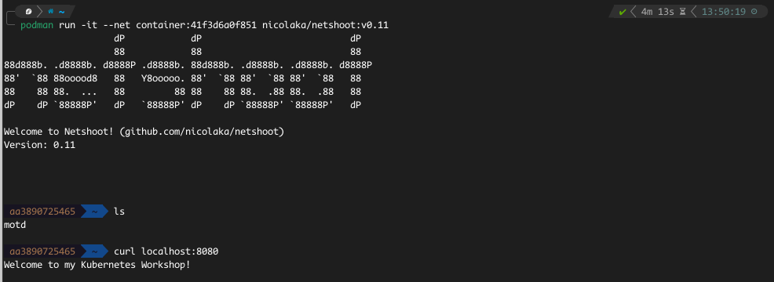

# Joining Two Container Network via the Network Namespace

## CheckList
- [] Create a simple HTTP server in Go
- [] Create a Dockerfile for the Go application
- [] Tag and push the image built to an image repository
- [] Joining another container to running HTTP server container
- [] Conclusion


## Create a simple HTTP server in Go
- First we create a simple application in Go that brings up the words, "Welcome to my Kubernetes Workshop!", when ran.

```Go
package main

import (
  "fmt"
  "log"
  "net/http"
)

func main() {
  http.HandleFunc("/", handler)
  log.Fatal(http.ListenAndServe("0.0.0.0:8080", nil))
}

func handler(w http.ResponseWriter, r *http.Request) {
  log.Printf("Ping from %s", r.RemoteAddr)
  fmt.Println(w, "Welcome to my Kubernetes Workshop!")
}
```

## Create a Dockerfile for the Go application
- With this Dockerfile, Go is a compiled language so we can use Alpine as a base image.
- In this, we compile the simple HTTP server application first with the command `CGO_ENABLED=0 GOOS=linux GOARCH=amd64 go build -o httpServer main.go`. It can now run anywhere, no dependencies needed.
- We construct a simple Dockerfile to take advantage of the compiled binary.

```Dockerfile
FROM alpine:3.16.8

# set up a working directory
WORKDIR /app 

# copy over the compiled binary only
COPY httpServer . 

# expose the port 8080
EXPOSE 8080 

# run the application
CMD ["./httpServer"]
```

## Tag and Push Image to Docker Registry
- Docker Registry is the most popular spot to get images from so it makes sense to push images there too.
- You can pull my image from my repo if you do not want to go through the hassle of working through all these.
- Pull my image with `docker pull ernestklu/httpserver:v0.0.1`. Works same with `podman` too, just substitute with `docker`.


## Joining another container to the running HTTP server container
- In here, we are going to connect another container to our running container's network namespace.
- A little refresh here:
  - a namespace can be defined as an isolated area that contains only the things needed in it available in there. 
  - extending this simple definition to cover Linux namespaces, it is an isolated area in Linux that contains only specific things needed in there.
  - then, a network namespace can be defined as an isolated area in Linux that only contains networking "stuff".
  - by extension, there are a lot of other namespaces available in the Linux kernel; PID, Mount, UTS (Unix Time-Sharing System) etc.
- For the connection, we are going to use an image that contains all the tools needed to troubleshoot a network in Linux, by a person called Nicolaka (bless him!).
- The goal here will be to connect to the running container and ping the address where our simple HTTP server is running in our Go container.

### Why?
- Good question! 
- This is to test out how I believe sidecar containers work in Kubernetes Pods.
- This is to confirm the way Docker/Podman works on our local machine; After starting a container, you can run a `curl localhost:port` command and connect to that address because the container is running on the network of the host, plugged into the host's network namespace.
- And also, it is a way to troubleshoot our container because it is very minimal and has none of these networking tools installed.

### How?
- Very simple!
- We run this command, assuming you have the same values I have; `podman run -it --net container:41f3d6a0f851 nicolaka/netshoot:v0.11`.
- This will plug into the network namespace of the HTTP server container and open up an interactive terminal for us.
- If we run `curl localhost:8080` in the interactive terminal, we get back our message that we get if we go to the same location in our browser.




## Conclusion
- I have already given it away but this is the way I assume sidecar containers works.
- With this implementation, I can see how sidecar containers can query and running container and get information from it without the original container having all the necessary tools to ship such information.
