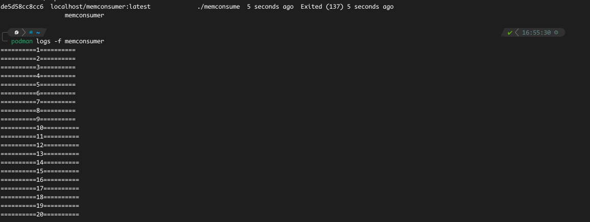

# Limiting the Resource Usage of a Running Application

## CheckList
- [] Write a program that consumes memory
- [] Package and push to Docker registry
- [] Run application with resource allocations

## Write a program that consumes memory
- In this program, we write a program in Go that consumes up to 50MB of RAM incrementally.
- The program logs how much memory it has consumed that we can easily view.
- The code is in the `main.go` file in this repo directory.

## Package and push to Docker registry
- We build and tag the image, `memconsumer` and push it to DockerHub.
- My image is ready to be pulled and used via `ernestklu/memconsumer:v0.0.1`.

## Run application with resource allocations
- Here, we will now attempt to run the application specifying a memory limit with the `--memory` flag in podman/Docker.
- First we allocate a generous amount of memory and then we stifle the amount in two separate experiments.

### First experiment 
- Run application with 60MB of RAM.
  - use the command `podman run --name memconsumer -d --memory=60m --memory-swap=60m memconsumer:v0.0.1`.
  - In the above command, we are setting a memory limit for the container and we are setting a swap-space limit for the container too
  - swap space is the space on a hard disk used as a temporary substitute for RAM.
  - So in this case, id the container decides to use swap, we have limited the amount it can use too.
- The container should run fine. Check the logs of the container, it should output 50 lines to ascertain that it has used 50MB of RAM.

### Second experiment 
- Run application with 20MB of RAM.
  - use the command `podman run --name memconsumer -d --memory=20m --memory-swap=20m memconsumer:v0.0.1`.
- The application should have exited if we check its status.
- If we check the logs, we should see only 20 lines in there.
- This proves that we have limited the resources the container can use, the program is supposed to run all 50 lines and then sleep for 1 hour. We have limited the resources it should use so it cannot continue its work and therefore exits.

## Conclusion
- This I believe is the way the resource and limits of Kubernetes YAML file works.
- A container is given a specific amount of RAM to run in, and given some more if it exceeds that amount.
- A container will fail it it consumes all available memory allocated to it.
- Also, this helps to to keep programs from greedily consuming memory.
