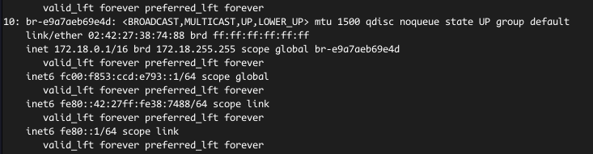
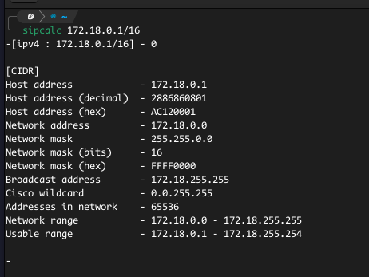

# Exposing a Pod via a Service

## CheckList
- [] Setup a Kubernetes environment
- [] Write the YAML configuration for Pod and Service
- [] Expose the Service and test connectivity

## Setup a Kubernetes Environment 
- I am running these on my local environment so I prefer KinD (Kubernetes in Docker). It uses Docker containers and powers of Kubernetes to set up container orchestration. The link to their site has all documentation needed to set up and user KinD, [here](https://kind.sigs.k8s.io/).
- Since this is not a virtual machine connected to the cloud, nor a Minikube setup, I have had to use MetalLB to expose my applications via the IP address pool of my KinD setup.
  - First, install MetalLB with the manifest found [here](https://metallb.org/installation/#installation-by-manifest).
  - Get the IP range of the bridge-network used by Docker to power KinD. 
  - Get the usable addresses from that range. I use a tool call `sipcalc` to do so.
  - Use a part of the usable IP to configure the AddressPool object in this [config](https://metallb.org/configuration/#layer-2-configuration). You need to use both the IPAddressPool and L2Advertisement configurations.
  - Deploy the Layer2 configuration objects above.
  - Your MetalLB is now ready to give IP addresses to any service that uses the type LoadBalancer.
  NB: If you use any other Kubernetes flavour, you might just need to expose a NodePort. But check with your environment first.

## Write the YAML configuration for Pod and Service 
- We are going to use the `httpserver` image we created in the first activity ([here](https://github.com/TaskMasterErnest/my-kubernetes-workshop/tree/main/01-joining-container-to-network-namespace-of-another-container)) to start a container.
- The configuration is in the `pod.yaml` file.
- Then write the configuration for the service `svc.yaml`, with type LoadBalancer.
- Create the objects using the `kubectl apply -f <config>` command.

## Test the Exposure
- If you have configured MetalLB correctly and successfully deployed the Pod and Service, you can access the running application by using `curl <IP-Address>:8080`.
  - Get the IP address by running the `kubectl get svc` command, and using the External-IP value.
- It should give you the message `Welcome to my Kubernetes Workshop!` in your console.
