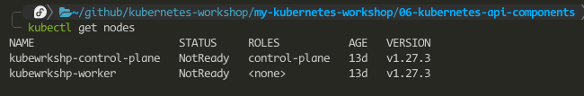
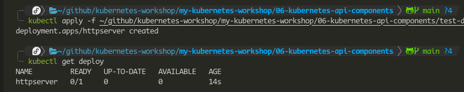
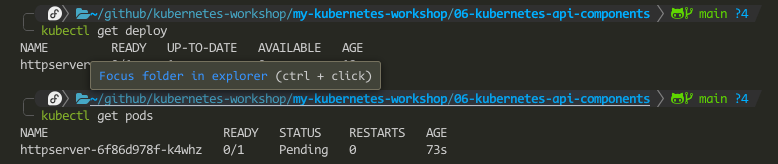
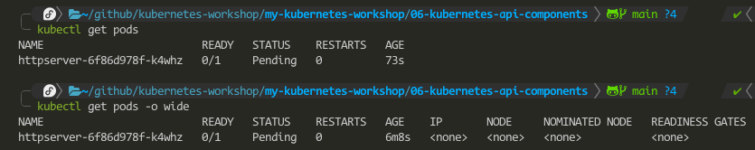
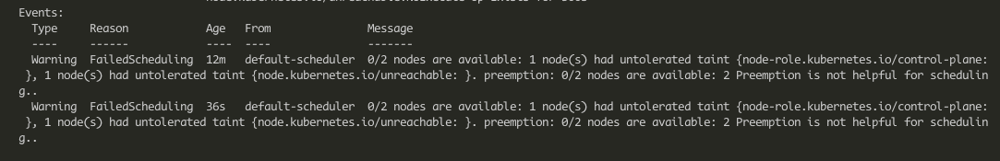
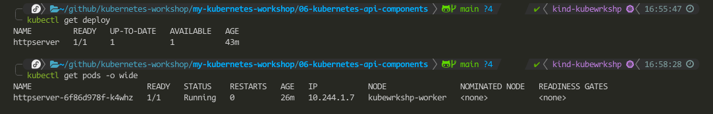

# Kubernetes API Components & Pod Lifecycle

In this trial, we will get to see how the Kubernetes API components manage the Pods that are provisioned on Kubernetes; especially the controller-manager, api-server and the scheduler and a little bit into etcd.
We will see how these components directly affect the working of the Kubernetes cluster when deploying/provisioning objects.

## CheckList
- [ ] Pod Life Cycle management 

## Walking through a Pod's Lifecycle
In this series of steps, we will look at how a Pod is given birth to on Kubernetes, all the processes it goes through to be come active and 'alive'.
1. A user sends a Deployment manifest file to the Kubernetes cluster, which is actually sent the Kubernetes API server. The API server validates the manifest data and if it passes, it is sent to be stored as a Deployment API object in etcd.
  - note that every step that involves modifying API objects, the API server has to interact with etcd to make sure the right object is stored.
2. The controller-manager gets notified from the API server that a Deployment has been created.
3. The controller-manager checks whether the desired number of replica Pods are running as per the Deployment manifest.
4. If the required number of Pods running is not met, the controller manager sends a Pod specification request to the API Server to create the specified number of Pods.
5. The Pods are created but at this stage, they are just some API objects residing in the etcd store. The scheduler now gets notified that some Pods have been created but they have no nodes assigned to them to run on.
6. The scheduler checks the resource usage of each node, as well as the Pod allocation on each node then it calculates the node that best fits each new Pod. At the end, it sends an updated Pod spec (with the *nodeName* section populated with the chosen node) to the API Server.
7. The Pods have been assigned a node to run on, however, no physical containers have been spun up and running. This is when the kubelet, running each on all worker nodes gets notified that some Pods are expected to be run. Each kubelet will then check if a Pod has been assigned to the node it [kubelet] is running on.
8. Once the kubelet determines that its node is supposed to be running a Pod, it calls on the underlying container runtime of the node to spin up containers with the Pod spec. When the containers are spun, the kubelet assumes responsibility for reporting the Pod's status to the API server.

This is the basic flow of how a Pod is birthed in Kubernetes.
And with this in mind, we can now explore and answer the following questions: 
  - Who is in charge of the Pod creation? What is the state of the Pod upon creation?
  - Who is responsible for placing a Pod? What is the state of the Pod after placement?
  - Who spins up the physical containers?
  - Who is in charge of the overarching message delivery process that ensures that all components work together?

Let us find out!

## Managing the Pod Lifecycle
If you have been using the same two-node cluster configuration, you will be having a master node and a worker node in the KinD cluster.
We will now dive deep into both of these nodes and directly manipulate the Kubernetes components in order to answer the questions.
First, you will need 3 terminal sessions. Two will be for the control-plane and worker nodes and the last one to check on the Kubernetes cluster.
1. Get into one of the terminals and run this command to enter the control-plane node; `sudo docker exec -it kubewrkshp-control-plane bash`. This will lead to the terminal of the control-plane node as it is running in Docker.
2. In another terminal, enter `sudo docker exec -it kubewrkshp-worker bash` to enter the control plane node.
3. To check on all the containers each node is running, type the command `crictl ps`, it should show you a list of all the containers running in each node. You are now direcly manipulating the underlying container runtime to check on the containers it is running. Type `crictl --help` for more information on the commands you can use.
4. Next, disable the kubelet on each node. Without the kubelet disabled, the later commands we will run will not have the needed effect. Use the `systemctl stop kubelet` command. Check whether it has truly stopped with the `systemctl status kubelet` command.
5. After 30+ seconds, check on the status of the Kubernetes cluster, both should show a 'NotReady' status. 
6. In the control-plane terminal session, stop the kube-controller-manager, kube-scheduler and the kube-apiserver. They are running as containers, use the following commands to do so:
  - `crictl stop $(crictl ps | grep kube-scheduler | grep -v pause | awk '{print $1}')`
  - `crictl stop $(crictl ps | grep kube-controller-manager | grep -v pause | awk '{print $1}')`
  - `crictl stop $(crictl ps | grep kube-apiserver | grep -v pause | awk '{print $1}')`
The `grep -v pause | awk '{print $1}'` commands get the exact containerID of the required containers and pause the running container.
7. Now provision a Deployment spec, use the `test-deploy.yaml` file and try to apply it in the Kubernetes cluster with `kubectl apply -f test-deploy.yaml`.
You should get a connection error response. This is because the 'kube-apiserver' is unavailable and cannot receive and process any kubectl commands that rely on API requests.
8. Restart the API server and try to recreate the Deployment once more. Use this command to start it, `critcl start $(crictl ps | grep kube-apiserver | grep -v pause | awk '{print $1}')`.
  - using this command might fail, there is a roundabout method to use but is tasking manually - ie to start the kubelet and stop it again. Then, stop only the controller-manager and scheduler this time.
With the API server now active and online, you can run the `kubectl show nodes` command and you will actual positive feedback.
9. Deploy the Deployment manifest file again and it should get created. 
10. Check whether the Deployment has been created successfully. In the preceeding screenshot, you can see that the READY column has '0/1' which indicates that there are 0 Pods associated with this Deployment but the desired number is 1.
11. Check whether the Pod is online, with the `kubectl get pods` command. Here, we get the messages that no resources are in there. 
- This is due to the fact that the API server only creates API objects, the implementation of these is carried out by other components and in this case the 'kube-controller-manager' is responsible for creating the Pods.
12. Restart the Controller-Manager, refer to Step 8 on how to do this. After waiting a few seconds, check on the status of the Deployment with `kubectl get deploy`. 
- It shows that the Pod we are waiting for is till currently not READY. Now check on the status of the Pod with `kubectl get pods`. 
- This output shows that the Pod is created but the STATUS is Pending.  This is so because assigning a node to run the Pod on is not the controller-manager's responsibility, it is the work of the 'scheduler'. 
- Before starting the kube-scheduler, run the `kubectl get pods -o wide` command. You see under the NODE column that there is no node assigned to the Pod. 
13. Restart the Scheduler and verify that it is working by running the `kubectl describe pods <pod-name>` command. Skip to the Events section and we find that the scheduler attempted scheduling but there is no node available to schedule on.
- This is because we have taken the kubelet offline. Its job is to check if a Pod has been assigned to its node and contract the container runtime to spin up a container. 
- On this, start the kubelet on the control-plane with `systemctl start kubelet`. This does nothing as we have a dedicated worker node to run Pods on. Start the kubelet on the worker node too. 
14. After starting the kubelet on both nodes, check the status of the deployment. You should get a 1/1 in the READY column, this shows that the Pod has been scheduled and is online. Verify the status of the Pod with `kubectl get pods -o wide` and you should find the worker node assigned to this Pod. 

## Conclusion
To answer the questions we posed in the first section; 
  - Step 12 shows us that the controller-manager is in charge of creating Pods.
  - Step 13 shows us that the scheduler is responsible for assigning Pods to nodes.
  - Step 14 shows us that the kubelet is responsible for the spinning up of the physical containers.
  - Even though it was not talked about much in every stage, Steps 7-9 show that the API Server is responsible for providing the API to talk to the components.

## Activity
A final thing to do is to perform the migration of our Pageview application to Kubernetes.
The application connects with a Redis datastore. 
The Kubernetes manifest files to set up the application are in the `pageview-....yaml` and `redis-....yaml` files.