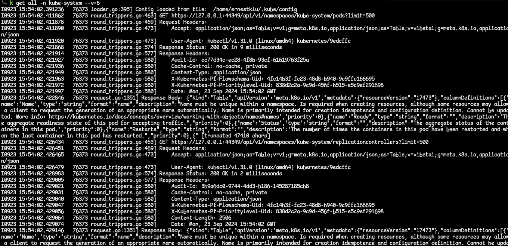

# How To Communicate With The Kubernetes API (API Server)
- In this session, we will look into buulding foundational knowledge and understanding of the API server and the various ways of interacting with it.
- We will see how kubectl and other HTTP clients communicate with the API server. We will see demos of how to trace the communications and see the details of HTTP requests.
- Also, we will see how we can look up the API details so that we can write our own API requests from scratch.

## Introduction
- As a recap, the API server acts as the central hub that communicates with all different components in Kubernetes.
- We are going to look in to the components that make up the API server. We will see how to effectively communicate with the API server and how these API requests are processed.
- We will look at API concepts that will help us understand the HTTP requests that are made to the API server. Concepts such as resources, API groups and API versions.
- We will then interact with the Kubernetes API using multiple REST clients to achieve many of the results we see when we use the kubectl command-line tool.

## The Kubernetes API Server
- All communication and operations in the Kubernetes cluster; between the control plane components and external clients (like kubectl) - are translated into **RESTful API calls** that are handled by the API server.
- So we can say the API server is a RESTful web server that processes RESTful API calls over HTTP. The calls are made, to store and update API object in the etcd datastore.
- The API server can also be seen as a frontend component that acts as a gateway to and from the outside world. A frontend that is accessible by all clients, including the kubectl CLI tool.
- The internal cluster components interact with each other through ONLY through the API server.
  - It is the ONLY component that interacts directly with the **etcd** datastore.
- It is important that the API server be configured correctly since it is the only way for clients to access the cluster.
- The way to see the API server in the components is to use the kubectl command `kubectl get pods -n kube-system`. The API server will have `kube-apiserver` in its name.
- The API server is stateless ie. its behaviour is consistent regardless of the state of the cluster.
- The API server is designed to scale horizontally.

## Kubernetes HTTP Request Flow
- We know now for a fact that, when we run any kubectl command, the command is translated into an HTTP API request in JSON format and is sent to the API server. Then the API server returns a response to the client along with any requested information.
- The following diagram shows the API request life cycle and what happens inside the API server when it receives a request. 
- .
- The request goes through the **authentication, authorization and admission** control stages.

### Authentication
- Every API call needs to authenticate with the API server, whether it is coming from outside the cluster (via kubectl) or from a process inside the cluster (such as those made by the kubelet).
- When the request reaches the API server, the API server needs to authenticate the client sending the request.
  - the request should (and usually) contains the username, user ID,and group - all necessary information needed for authentication.
- The authentication methods will be determined by either the header or the certificate of the request.
- To deal with the different methods for authentication, the API server has different auth plugins, such as ServiceAccount tokens (for authenticating ServiceAccounts) and one other method to authenticate users, usch as the X.509 client certificates.
- **NOTE**: the cluster admin is the one who usually defines the auth plugins during cluster creation. Learn more [here](https://kubernetes.io/docs/reference/access-authn-authz/authentication/).
- The API server will call these plugins one-by-one until one of them authenticates the request. If all of them fail, the auth process fails. If not, the authentication phase completes and the request proceeds to authorization.

### Authorization
- [docs](https://kubernetes.io/docs/reference/access-authn-authz/authorization/)
- The authorization stage is where it is determined whether the user is permitted to perform the requested action.
  - There are various levels of privileges that different users can have; eg. eg listing pods in a namespace, delete deployments etc. These kinds of decisions are made in the authorization phase.
- Provided we have two users, stated below:

- The above user **ReadOnlyUser** tries to do certain things in the cluster and this is what happens:

  - the **Forbidden** error is returned by the authorization plugin.
- Thankfully, kubectl provides a command that can be used to check whether an action is allowed for the **current** user. The command is `kubectl auth can-i`. 
  - a very intuitive command. eg. to check if you can delete deployments: `kubectl auth can-i delete deployments`. 
  - run the `kubectl auth can-i -h` for help.
- Authorization modules are checked in sequence. When multiple authorization modules are configured, if any authorizer approves or denies a request, that decision is immediately returned and no other authorizer will be contacted.

### Admission Control
- [docs](https://kubernetes.io/docs/reference/access-authn-authz/admission-controllers/)
- After the request is authenticated and authorized, it goes to the admission control modules. 
  - These modules can modify or reject requests.
  - if the request is only doing a READ operation, this stage is bypassed. But if it is trying to create, modify or delete, it is sent to the admission controller plugins.
- A cluster is initiated with a set of predefined admission controllers. Custom admission controllers can be defined as well.
- Like authorization modules, if any admission controller module rejects the request, that request is dropped and not processed further.
- Some examples of how the admission controller objects works is:
  - If we configure a custom rule that every object should have a label, then any request to create an object without a label will be rejected by the admission controllers.
  - When a namespace is deleted, Kubernetes will try to delete all resources in there before deleting. That state is called the **Terminating** state. In this state, we cannot create any new objects in this namespace. The **NamespaceLifecycle** is what prevents that.
  - When there is a request to create a resource in a namespace that does not exist, the **NamespaceExists** admission controller rejects this request.
- Not all of the admission controllers are enabled by default. And the default modules activated chaneg based on the Kubernetes version.
- Cluster admins can decide which modules to enable or disable when initializing the API server.
- To control which of the admission modules to enable or disable other than the default ones, theses flags, `--enable-admission-plugins` and `--disable-admission-plugins` are used.
*see exercise 4.01*

### Validation
- After letting the request pass through all three stages, the API server then validates the object - that is, it checks whether the object specification, carried in the JSON format in the response body, meets the required format and standard.
- After successful validation, the API server stores the object in the etcd datastore and returns a response to the client.

## The Kubernetes API
- The Kubernetes API uses JSON over HTTP for its requests and responses. It follows the REST architectural style.
- The Kubernetes API can be used to read and write Kubernetes resource objects.
- Just like HTTP methods, the Kubernetes API allows clients to create, update, delete or read an object via standard HTTP methods.
  - an example can be seen here: 
- The API calls carry JSON data and all of them have a JSON schema identified by the **Kind** and **apiVersion** fields.
  - the Kind field is a string the identifies the type odf JSON schema that an object should have. The apiVersion is a string that identifies the version of the JSON schema the object should have.
- The best way to understand how the Kubernetes API works with requests is to trace a kubectl command.

### Tracing kubectl HTTP Requests
- [kubectl verbosity and debugging flags](https://kubernetes.io/docs/reference/kubectl/quick-reference/#kubectl-output-verbosity-and-debugging)
- We can start tracing the HTTP requests that the kubectl sends to the API server.
- Suppose we want to get the pods in the kube-system namespace. We run the command `kubectl get pods -n kube-system`.
  - behind the scenes, what this does is to invoke an HTTP GET request to the API server endpoint and requests information from the `/api/v1/namespaces/kube-system/pods`.
- We can enable a verbose output to our command. If we do this, we get more details in the response. The verbosity ranges from 1 to 10. We enable this by adding the `--v=n` flag to the command, where `n` is the number.
- We get a pretty hefty output: 
- Now, let is delve into the output bit by bit to get a better understanding of this.
  - The first part of the output is as follows: 
    - From this, we can see that the kubectl loaded the configuration from the kubeconfig file. That file has the API server endpoint, port, and credentials (certificate or auth token).
  - The next part: 
    - This line contains the action to perform against the API server. The line contains the path to go visit and the limit on the number of resources to return. The limit here is 500; kubectl fetches a large chunk of resources in order to improve latency.
  - The next part of this output is this: 
    - In this part of the output, the Request Headers describes the resource to be fetched or the client requesting the resource. There are two parts of this, and they are used for content negotiation - like this:
      - **Accept**: This is used by HTTP clients to inform the server about the types fo content they (client) will accept. In the output, we can see that the client requests to be handed the content type as an *application/json*. If this content type is not available on the server, it will return the default preconfigured representation type, which is the same *application/json* (as this is what the Kubernetes API server uses as its JSON schema). We can also see that the client is request the output as an APIGroupDiscoveryList as indicated by the **as=** line.
      - **User-Agent**: This header contains information about the client that is requesting the information. In this case, we can see that kubectl is providing information about itself.
  - Moving unto the next part: 
    - Here, we can see that the API server returns a 200 Status Code indicating that the request has been successfully processed. Also,we can see the time taken to process this request.
  - The next part of: 
    - This shows the Response Headers and the main response body sent by the API server.
    - The response body contains the resource data that was requested by the client but in raw JSON format before it can be translated into the response content type the client requested it in. To see the full body response, the verbosity level 10 will do.

### API Resource Type
- In requesting resources from the API Server, we use the HTTP URL which contains the API resource, API Groups and API Version.
- In this section, we will concentrate more on the resource type in the URL such as pods, namespaces, and services. In the JSON format, this is labelled **Kind**.
- The resources can be a collection of resources, or a single resource.
  - For the *collection of resources*, this represents a collection of instances for a resource type. In a URL, this will be how it is represented `GET api/v1/pods`.
  - For a single resource, this represents a single instance of a resource type. The URL to this is more specific; `GET api/v1/namespaces/{namespace}/pods/{pod}`.
- Therefore, in requesting a resource in Kubernetes, you can call for a collection of resources ar a single resource.

### Scope of API Resources
- The resources in Kubernetes can be either cluster-scoped or namespace-scoped. The scope affects the access of that resource and how that resource is managed.

#### Namespace-Scoped Resources
- Kubernetes makes use of Linux namespaces to organize most resources.
- Resources in the same namespace share the same access control policies and authorization checks.
- Let us see what forms the request paths for interacting with namespace-scoped resources:
  - get info about a specific pod in a namespace `GET api/v1/namespaces/{namespace}/pods/{pod}`
  - get info on a collection of Deployments in a namespace `GET apis/apps/v1/namespaces/{namespace}/deployments`.
  - get info on all services across all namespaces `GET ap1/v1/services`
- Now, notice that, when getting information on a resource across all namespaces, it will not have a namespace in its URL.
- To get the full list of all namespace-scoped resources, use this kubectl command: `kubectl api-resources --namespaced=true`.

#### Cluster-Scoped Resources
- Most Kubernetes resources are namespace-scoped. Any resource that cannot be found under a namespace/within a namespace is cluster-scoped. 
  - an example is a node. You can deploy a pod in a namespace regardless of the namespace you want the pod to be in. A node can also host different pods from different namespaces. Also, you might have guessed it, nodes host the namespace resource ie namespaces are found inside nodes.
- Let us see the request paths for interacting with cluster-scoped resources:
  - get info on a specific node in the cluster: `GET api/v1/nodes/{node}`.
  - get info on all nodes in the cluster: `GET api/v1/nodes`.
- In order to get all the resources that are cluster-scoped, use the kubectl command: `kubectl api-resources --namespaced=false`.

## API Groups
- API groups are a collection of Kubernetes resources that are logically related to each other. eg. Deployments, ReplicaSets and DaemonSets all belong to the app API groups **apps/v1**.
- The `--api-group` flag can be used to scope the output to a specific API group.

### Core Group
- The core group is the legacy API group. It contains resources like pods, services, nodes and namespaces.
- The URL path for these is the `/api/v1`, and only the version is specified in the **apiVersion** field.
- If you look at the manifest for a Pod, you will be the version `v1` value for the apiVersion key.
- To get the Kubernetes resources that are under any API group, use the kubectl command; `kubectl api-resources`.
  - to narrow down to resources in the core API group, use the kubectl command: `kubectl api-resources --api-group=''`.

### Named Group
- The named group is for Kubernetes resources for whom the request URL is in the form `/api/$NAME/$VERSION`.
- The named groups contain the group name in the URL.
- To get the resources that belong to a named group, use the flag `--api-group=<NAMED_GROUP_NAME>`.
  - use the kubectl command: `kubectl -api-resources` command to get all resources and their respective APA groups.

### System-Wide Group
- This group consists of system-wide API endpoints, such as **/version, /healthz, /logs, /metrics**.

## API Versions
- In the Kubernetes API, the API supports multiple versions on a type of resource.
- These different versions may act differently, each different API path has a specific role to play, such as api/v1 or apis/extensions/v1beta1.
- The different API versions differ in terms of stability and support:
  - **alpha**: this version is indicated by the alpha in the apiVersion field, eg. **/apis/batch/v1alpha1**
    - The alpha version of resources are disabled by default as it is not intended for production clusters.
    - The resources are to be used by early adopters and developers who are willing to provide feedback and suggestions and report bugs.
    - Also, the support for these may be dropped by the time the final stable version of Kubernetes is finalized.
  - **beta**: this version is indicated by beta in the apiVersion field, eg. **/apis/certificates.k8s.io/v1beta1**.
    - The beta version of resources is enabled by by default, and the code is well tested.
    - Using these beta resources is recommended for scenarios that are not business-critical and it is possible that changes in subsequent releases may reduce incompatibilities.
  - **stable**: for these versions, the apiVersion field contains the version number without any mention of alpha or beta, eg. **/apis/networking.k8s.io/v1**.
    - the stable version is supported for many subsequent releases of Kubernetes.
- To get a complete list of the api versions available in the Kubernetes API, use the command `kubectl api-versions`.
- The difference in the versions is that of feature support. Look up the versions online to see the features they support.
- Looking up the info online can be overwhelming but Kubernetes provides a way to access all the information you need regarding the API resources. You can use kubectl to access the Kubernetes documentation and get the necessary info about the API resources.
*see exercise4.02*

### How To Enable/Disable API Resources, Groups or Versions
- In a typical cluster, not all API resources are enabled by default. This API resources to use depend on the cluster use case, determined by the cluster admins.
  - an example is that cloud services that provide Kubernetes disable the use of alpha versions for security and stability reasons.
- Despite this, the API resources/versions can be enabled on the API server using the `--runtime-config` flag - which accepts comma-separated lists.
- To be able to create any resource on a Kubernetes cluster, the group/version should be enabled in the cluster else there will be an error creating that resource.
  - eg. creating a `CronJob` resource, the `batch/v2alpha1` version should be enabled in the cluster.
  - to enable a group/version, you will need to set the `--runtime-config=batch/v1alpha1` on the API server. This can be done either during the creation of the cluster, or by updating the **/etc/kubernetes/manifests/kube-apiserver.yaml** manifest file.
  - to disable, the same flag can be used by setting the group/version to false like, `--runtime-config=batch/v2alpha1=false`.
  - a special key `api/all` is used to control all API versions. To be selective about the group/versions to enable or disable, you can pair them in a true/false situation like this:
    - turn of all API versions except v1: `--runtime-config=api/all=false,api/v1=true`.
- **NOTE**: Let us say we want to disable a specific group or version of API resources. eg. we want to disable ingress.
  - we have ingress in the `extensions` and `networking.k8s.io` API groups.
  - and assuming we decide to disable the ingress version `v1beta` from the `extensions` group, the runtime configuration flag for this will be: `--runtime-config=extensions/v1beta1/ingresses=false`.
*see exercise4.03*

## Interacting With Clusters Using The Kubernetes API
- The default way we access Kubernetes clusters (specifically the API Server) is by using the kubectl command-line tool.
  - kubectl does this m=by extracting the API server address and auth info from the client's kubeconfig file (usually located in **~/.kube/config**).
- There are two more ways we can get access to the API Server via its REST API.
  - the first is, using kubectl in proxy mode
  - the latter is by providing the location creds and the auth creds directly to the HTTP client.
- both these methods will be explored and the pros and cons laid bare before us.

### Accessing The Kubernetes API Server using kubectl As a Proxy
- kubectl has a feature called **kubectl proxy** which is the recommended approach for interacting with the API server.
  - this is because (1) it is easier to use and (2) it verifies the identity with the API server by using a self-signed certificate which prevents MITM (man-in-the-middle) attacks, overall providing more security.
- the kubectl proxy routes requests from the HTTP client to the API server whilst taking care of authentication by itself. This auth is handled with the configuration in the kubeconfig file found locally.
- In the following example, I have an NGINX deployment scaled to run two pods in the default namespace.
  - starting the proxy is as simple as running the command `kubectl proxy`. In this case, we are going to customize the how and where the proxy is exposed on a bit.
  - with the command, `kubectl proxy --port=8080 &`, we specify that the proxy be exposed on port 8080 of the local machine and we add the `&`, a Linux command to run the proxy in the background so we still have access to the terminal.
  
  - we can start exploring the API server apis by querying the API server on this path shown. This path returns a response that looks something like this:
  
  - Let us continue and drill down. What if we want to get information about the NGINX deployment we just made? How can we query the API server in order to get to that specific information? We can start by asking ourselves a few questions.
    1. What is the API group and API version assigned to/used by the Deployments resource?
      - If you remember, great. If not, run the command `kubectl api-resource | grep deployments`. The answer is on the third column: `apps/v1`.
      - we can then query the API server on that path as shown:
    
    2. We then ask ourselves, is the Deployment resource a namespaced-scoped or cluster-scoped resource?
      - the answer is on the fourth column of the command `kubectl api-resource | grep deployments`.. You can also run the `kubectl api-resource --namespaced=true` and look through the output.
      - indeed Deployments is a namespaces-scoped resource and we can get the collection of these Deployments along this path `apis/apps/v1/namespaces/{namespace}/deployments`.
    
      - from the image above, we have a list of Deployments in the default namespace of our cluster. We can then drill down to the specific deployment to get information on that.
    
  - We can this procedure to get information on any other resource as well.

### Creating Kubernetes Objects Using curl
- Yes, we can use the cURL command to make requests to the API server and create Kubernetes requests.
- Before doing so, there are three(3) essential things to take note of:
  1. use the POST HTTP method. The default cURL command used a GET method. Change that with the syntax `curl -X POST <all-other-stuff>`.
  2. Set the appropriate request header. The header is to inform the API server on tha additional relevant information about the request being sent. In this case, we want to set the request in YAML format so we can set a Header to be `'Content-Type: application/yaml'`.
  3. Include the spec of the object to be created. The spec must be in YAML format. You can pass the spec to the cURL request using the `--data <spec/manifest>` flag.
    - a great way to get a manifest file from the cluster is to run a object creation command and get the output. We do this with the `--dry-run=client -o yaml` command.
    - when you run a command with the `--dry-run=client` flag, the command goest through the stages of authentication, authorization and validation but the changes that it requests are not persisted to the etcd database. This is a great way to test if a certain command will work. With the `-o yaml` flag, we can get the manifest file created for this command.
*see exercise4.04*

### Direct Access To The Kubernetes API Using Authentication Credentials
- We can use a method of directly providing the auth credentials directly to the HTTP client, instead of using proxy.
  - this will help anyone who does not work well with proxies
  - but this approach is less secure as this is susceptible to MITM attacks. To mitigate the MITM attack risks, it is recommended to import the root certificate and verify the ID of the API server.
- In using this method to access the API server, using credentials, it is important to know how the authentication for the cluster is configured and what auth plugins have been used.
  - there are many auth plugins which allow for authenticating to the API server, such as: client certificates, ServiceAccount bearer tokens, Authenticating proxy, HTTP basic authentication...etc.
- You can check the authentication plugins that are enabled in this cluster by looking at the API server processes that are running. `kubectl exec -it kube-apiserver-<any-other-addition> -n kube-system -- /bin/sh -c "apt update ; apt install -y procps ; ps aux | grep kube-apiserver`.
  - for my KinD cluster, I have to resort to using Docker to exec into the control plane container with this command: `docker exec -it k8s-wrkshp-control-plane bash -c "ps aux | grep kube-apiserver"`.
  - the output is a list of processes, filtered by the *kube-apiserver* keyword. But here are the parts we are interested in; the client-ca-file and the serviceaccount-key-file:

- These flags tell us that we have two different authentication plugins configured:
  - X.509 client certificates (based on client-ca-file) and
  - ServiceAccount token (based on the second file).
  - We will now look at how to use both these auth methods to communicate with the API server.

#### Method 1: Using Client Certificate Authentication
- X.509 certificates are used to authenticate external requests, which is the current configuraton in the kubeconfig file.
- The *--client-ca-file* indicates the certificate authority that is used to validate client certificates, which will authenticate with the API server.
- An X.509 cert defines a subject, which is what identifies a user in a Kubernetes cluster. Taking a look at the X.509 cert information, when this is used for authenticating a Kubernetes user, the **Common Name** of the subject is used as the username for the user, and the **Organization** field is used the group membership of that user.
- Kubernetes uses a TLS protocol for all of its API calls as a security measure. The kubectl proxy we used in the previous takes care of the communication with the API server over TLS when we were using the HTTP client over HTTP / the cURL command.
- To use the same method here, ie using the cURL to communicate with the API server (with not proxy available), we need to add three more details to all the API calls:
  - (1) `--cert`: the path to the client certificate; (2) `--key`: the path to the private key and (3) `--cacert`: the path to the certificate authority.
- the command syntax that can be used, in combination with these three details, is `curl --cert <path/to/client/certificate> --key <path/to/private/key> --cacert <path/to/certificate/authority> https://<API-server-address>:<port>/api`.
- All these details can be gotten from the kubeconfig file. Use the command `kubectl config view` to get these details.

#### Method 2: Using a ServiceAccount Bearer Token
- Service accounts are meant to authenticate processes running within the cluster, such as pods, to allow the internal communication between them and the API server.
- They use **signed bearer JSON Web Tokens (JWTs)** to authenticate with the API server.
  - these JWTs are stored in Kubernetes objects called Secrets - which are used to store sensitive information. This information is base64 encoded.
- Each ServiceAccount has a corresponding Secret associated with it.
  - When a Pod uses a ServiceAccount to authenticate with the API server, the Secret is mounted on the pod, the bearer token decoded and placed at this location `/run/secrets/kubernetes.io/serviceaccount` inside the Pod. This can then be used by any process in the Pod to authenticate with the API server.
- ServiceAccounts alone are not sufficient. Once authentication is successful, the ServiceAccount needs to receive authorization to perform any action.
  - this authorization is managed by **Role-Bases Access Control** (RBAC) policies.
  - in Kubernetes, you can define **Roles** and use **Rolebinding** to *bind* these roles to certain users or ServiceAccounts
  - A **Role** defines what actions, also called API Verbs, are allowed and which API groups and resources can be accessed.
  - A **RoleBinding** defines which user or ServiceAccount can assume that Role.
  - **NOTE**: A ClusterRole is similar to a Role but is cluster-scoped. A ClusterRoleBinding - also similar to RoleBinding.
- Every namespace created in the Kubernetes cluster has a ServiceAccount called **default**. This is unique to the namespace, even though the name is the same through all. 
  - get the ServiceAccounts with the command: `kubectl get serviceaccounts --all-namespaces`.
  - remember that every ServiceAccount has a Secret associated with it. This Secret has the following: a certificate authority to validate certificates, the namespace of the secret and the JWT token, all encoded in base64.
- These above-metioned Secret values are available to be seen, if you can take the time to do so. Let us get these values in this demo.
  1. Exec into the Kubernetes Pod you want. Use the `kubectl exec -it <pod-name> -- bash`. If you are using a KinD cluster like me, there are a couple of hoops to jump through listed below:
    - exec into a worker node Docker container, `docker exec -it <worker> bash`.
    - list the Pods in that container, `crictl pods`. `crictl` is containerd's CLI tool to interact with container runtimes.
    - get the Pod ID of the specific Pod you want. Use this to get the container ID of the container running in the Pod, `crictl ps -p <POD_ID>`.
    - after obtaining the container ID, exec into the container with `crictl exec -it <CONTAINER_ID> sh`.
  2. Check the filesystems mounted in that container with `df -h`. Spot the filesystem that shows the serviceaccount being mounted into the Pod.
  3. List out the content, and you find the API server CA certificate, namespace and JWT token used.
  
  4. Now let us list the pods we have in a namespace using the API path we know, via cURL. Like this: `curl https://kubernetes.default.svc/api/v1/namespaces/kube-system/pods`. We get this output:
  
  - this shows that Kubernetes rejected the incoming request since it forces all communications to happen over TLS.
  - Let us allow an insecure connection with the `--insecure` flag:
  
  - With an insecure connection, we are now able to reach the server. But the server treats our request as anonymous because there is no identity attached to the request.
  5. Let us provide an identity with the CA cert, namespace and JWT token that we have. Put them as environment variables we can pass into the request URL. ie. `CACERT=/run/secrets/kubernetes.io/serviceaccount/ca.crt`, `TOKEN=$(cat /run/secrets/kubernetes.io/serviceaccount/token)` and `NAMESPACE=$(cat /run/secrets/kubernetes.io/serviceaccount/namespace)`.
  - the JWT bearer token has to be passed in the request in the Authorization Header.
  - Run the cURL command again, this time with the identity of the ServiceAccount, `curl --cacert $CACERT -H "Authorization: Bearer $TOKEN" https://kubernetes.default.svc/api/v1/namespaces/kube-system/pods`.
  - **NOTE**: When working with Kubernetes, the cluster DNS or location when you are **inside** of the cluster is **kubernetes.default.svc**. When **outside** of the cluster, it is the server address gotten from the kubeconfig file.
  - We get this response:
  
  - In the response, we were able to reach the API server and it verified the identity as `system:serviceaccount:test:default` (since we are requesting from the test namespace). Note that the identity is represented in this format **`system:<resource_type>:<namespace>:<resource_name>`**.
  - Also, in the response, we got the Forbidden error because ServiceAccounts do not have any permissions by default. We need to manually assign permissions to them by RoleBinding them to a ClusterRole.
  6. We create a RoleBinding resource that links the ServiceAccount and its namespace to the ClusterRole we specify. Here, we are using the **view** ClusterRole. The command is `kubectl create rolebinding testSA-view --clusterrole=view --serviceaccount=test:default --namespace=test`.
  - Note that we have to specify the ServiceAccount as `<namespace>:<ServiceAccountName>`.
  - Once the RoleBinding has been created, run the cURL command again with the CA cert, token and namespace. This time we use the namespace we are in. `curl --cacert $CACERT -H "Authorization: Bearer $TOKEN" https://kubernetes.default.svc/api/v1/namespaces/$NAMESPACE/pods`.
  
  - We get a successful response.
- It is valid to use ServiceAccount Bearer tokens outside the cluster. It is better to use them instead of certificates for long-standing jobs since tokens do not expire as long as the ServiceAccount exists.
  - An scenario in which this might be used is in a CI/CD pipeline where external services use ServiceAccount bearer tokens for authentication.

*see activity4.01*