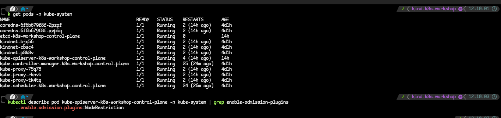
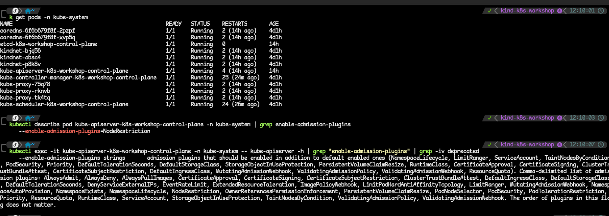
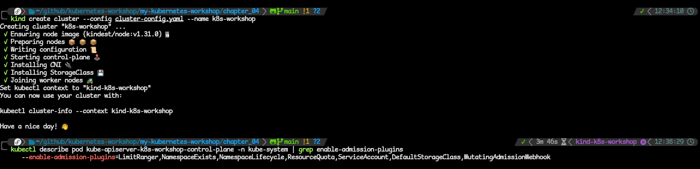

# Starting K8s With A Custom Set Of Modules.
- I am using the lightweigth KinD clusters as stated but the kubectl commands should be the same across Kubernetes.

### Start Kubernetes
1. Use the `kind create cluster` command.
2. Check which pods are enabled by default.
  - use the command against the api-server for your Kubernetes flavour. In this case, my api-server is `kube-apiserver-k8s-workshop-control-plane`.
  - run the command `kubectl describe pod kube-apiserver-k8s-workshop-control-plane -n kube-system | grep enable-admission-plugins`.

  - here, you can see that the only admission controller plugin I have is the NodeRestriction.
  - another way to check the admission modules is to view the API server manifest by running the following command. `kubectl exec -it kube-apiserver-k8s-workshop-control-plane -n kube-system -- kube-apiserver -h | grep "enable-admission-plugins" | grep -iv deprecated`

3. Now we will start the KinD cluster with the new configuration. Each Kubernetes flavur has a different way of adding these extra configuration to the control plane. For KinD:
```bash
kind: Cluster
apiVersion: kind.x-k8s.io/v1alpha4
nodes:
- role: control-plane
  kubeadmConfigPatches:
  - |
    kind: ClusterConfiguration
    apiServer:
        extraArgs:
          enable-admission-plugins: LimitRanger,NamespaceExists,NamespaceLifecycle,ResourceQuota,ServiceAccount,DefaultStorageClass,MutatingAdmissionWebhook
```
  - put that in a file `cluster-config` and run the KinD cluster command against it. ie. `kind create cluster --config //path-to-config`.
