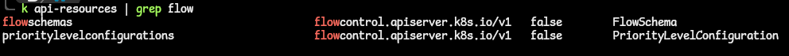
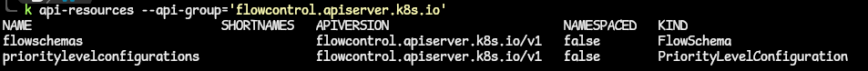
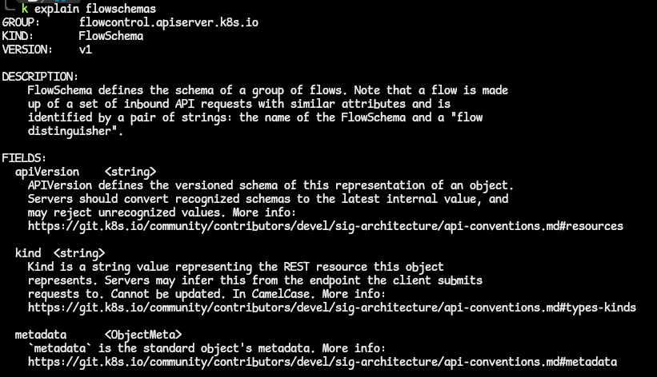
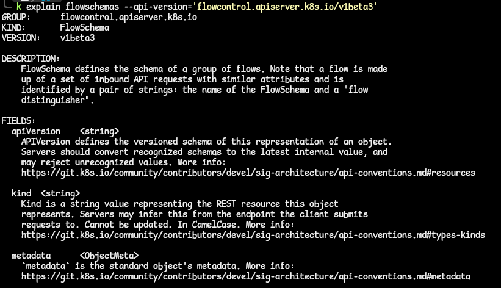
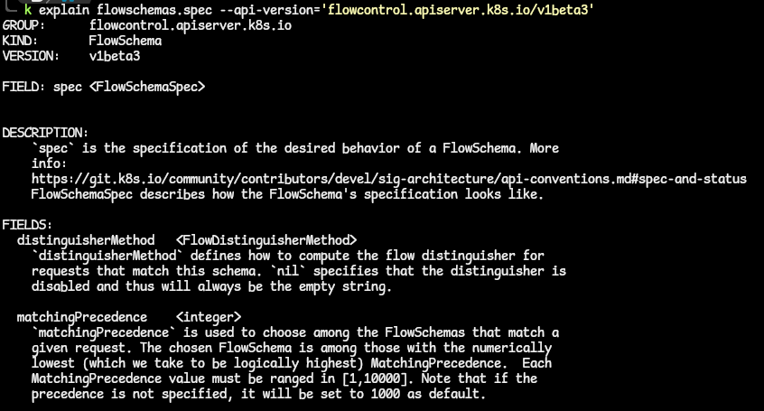
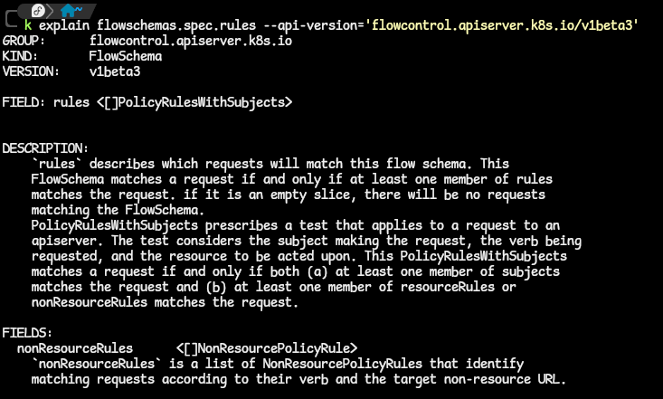

# Getting Information About API Resources
- Let us assume we want information about a lot of the FlowSchema API resource. We want to determine the API versions that are available and the groups they belong to.
- These are the steps we need to take in order to get these information.

1. Get all API resources that match the flow keyword:
`kubectl api-resources | grep flow`

2. Unfortunately, both these resources are in the same API group.
  - check with the command `kubectl api-resources --api-group='flowcontrol.apiserver.k8s.io'`

3. We can get more information about the FlowSchema from the Kubernetes docs with the command:
`kubectl explain flowschemas`
  - this command describes the API resource, as well as the details of the fields associated with it.

  - There is a beta version of this FlowSchema resource. We can get the description of that particular version using the command; `kubectl explain flowschemas --api-version=flowcontrol.apiserver.k8s.io/v1beta3`.

4. We can filter the output of the **kubectl explain** command using the **JSONPath** identifier.
  - this allows us to get information about the fields that we specify when writing the Kubernetes YAML manifest. eg. if we want to see the spec fields for the flowschemas, the command will be `kubectl explain flowschemas.spec --api-version=flowcontrol.apiserver.k8s.io/v1beta3`

  - We can dive deeper into the fields and get more details about these nested fields. eg. to get more information about the rules under the spec field, the command is `kubectl explain flowschemas.spec.rules --api-version=flowcontrol.apiserver.k8s.io/v1beta3`

  - We can repeat this to obtain information about any field that can be used in the YAML manifest.