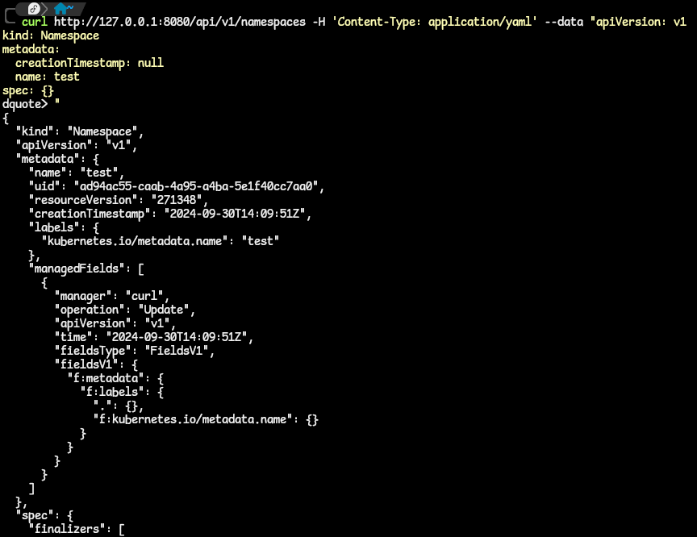

# Creating and Verifying a Deployment Using kubectl proxy and cURL
- For this exercise, we will create an nginx deployment with 3 replicas in a namespace called test. 
- We will do this by sending out request with cURL to the API server through the kubectl proxy.

1. Start the proxy in the background: `kubectl proxy --port 8080 &`.

2. The **test** namespace does not exist.
  - Let us create it, but not persist it, with the kubectl command we have learned: `kubectl create namespace test --dry-run=client -o yaml`.
  - The output will be like this:
  ```yaml
  apiVersion: v1
  kind: Namespace
  metadata:
    creationTimestamp: null
    name: test
  spec: {}
  status: {}
  ```

3. Now we need to send a request to the API server via cURL.
  - namespaces are a part of the core API group and hence to get there, we need the correct path. ie. `apps/v1/namespaces`.
  - The cURL command to create the namespace will look like this:
  ```bash
  curl -X POST http://127.0.0.1:8080/api/v1/namespaces -H 'Content-Type: application/yaml' --data "
  apiVersion: v1
  kind: Namespace
  metadata:
    creationTimestamp: null
    name: test
  spec: {}
  status: {}
  "
  ```
  - If everything runs, you should get a response in the terminal similar to this:
  

4. Same procedure applies to creating an NGINX deployment with 3 replicas. We will modify the generated manifest to hold the exact number of replicas we need.
  - For deployments, they are in the `apis/apps/v1` and the namespace has to be added so that they are deployed in the test namespace, `/namespaces/test`.
  - Use this to generate the manifest: `kubectl create deployment nginx-test --image=nginx:latest --dry-run=client -o yaml`
  - the cURL command to use for creating this Deployment resource is this; note that the correct path to the deployment group is indicated:
  ```bash
  curl -X POST http://127.0.0.1:8080/apis/apps/v1/namespaces/test/deployments -H 'Content-Type: application/yaml' --data "
  apiVersion: apps/v1
  kind: Deployment
  metadata:
    creationTimestamp: null
    labels:
      app: mynginx
    name: mynginx
    namespace: test
  spec:
    replicas: 3
    selector:
      matchLabels:
        app: mynginx
    strategy: {}
    template:
      metadata:
        creationTimestamp: null
        labels:
          app: mynginx
      spec:
        containers:
        - image: nginx:latest
          name: nginx
          resources: {}
  status: {}
  "
  ```

5. You can now stop the proxy with the `fg` command and `Ctrl ^C`.