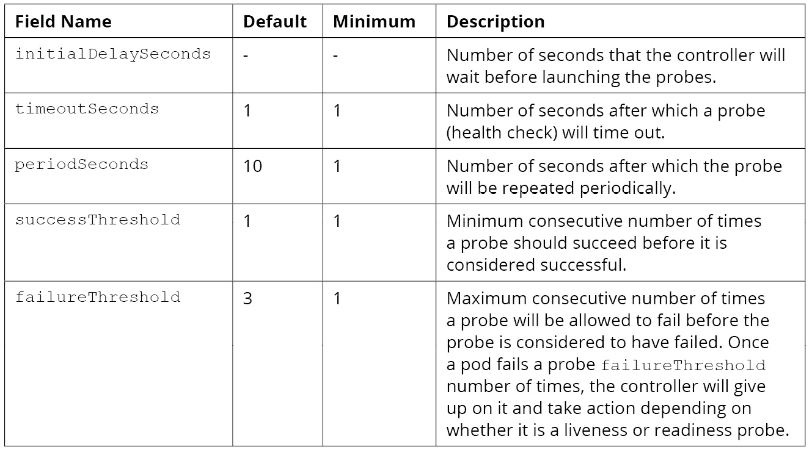

# Pods
- In this session, we will know how to properly configure Pods and deploy them.
- We will take a look at the different aspects of Pod configuration, and learn how to decide on which configuration to use based on the application or the use-case.
- We will delve into how to define resource allocation requirements and limits for Pods.
- We will then look into how to debug Pods, check logs in Pods and make changes to Pods on the fly when needed.
- We will discuss some useful tools for managaing faults in Pods such as liveness- and readiness-probes and also restart policies.

## Introduction
- A pod is the basc building block of Kubernetes, it can also be described as the basic unit of deployment in Kubernetes.
  - just like how we can say a process is a program in execution, we can say that a Pod is a running process in the Kubernetes world.
  - they are also described as the smallest unit of replication in Kubernetes.
- A pod can have multiple containers running in it. It is basically a wrapper around containers running on a Kubernetes node.
- Using Pods instead of containers provide benefits such as shared storage volumes, shared Linux namespaces and shared cgroups.
- A Pod has a unique IP address and port address space that is shared by all the containers in the Pod. This way, the containers in the Pod can talk/communicate with each other using the localhost.
- Ideally, Pods should have multiple containers only when we need these multiple containers to be managed and located together in the Kubernetes cluster.
  - an example will be a container that collects logs from another container housing the application and converts those logs into a usable format and store them in a central storage location. These containers need to be able to communicate via their ports on localhost so it will be easier getting the required stuff from them.
  - the multi-container setups are discussed here in this article about [multi container pods patterns](https://dzone.com/articles/multi-container-pod-design-patterns-in-kubernetes#:~:text=If%20you%20have%20to%20make%20it%20deployable%20in,depending%20upon%20the%20Dev%2C%20QA%2C%20or%20Stage%20environment.)


## Pod Configuration
- To be able to successfully configure a Pod, we must be first be able to read and understand a Pod configuration file. A sample is this, note that it is written in the YAML format:
```YAML
apiVersion: v1
kind: Pod
metadata:
  name: <pod_name>
spec:
  containers:
  - name: <container-1-name>
    image: <image-1>
  - name: <container-2-name>
    image: <image-2>
```
- A couple of these components in the configuration are familiar from the API version session. We can break a Pod's configuration into four main components:
  - **apiVersion**: version of the Kubernetes API we are using. 
  - **kind**: this is the Kubernetes object to be created.
  - **metadata**: information that uniquely identifies the object being created.
  - **spec**: specification of the Pod; name, image to use, volumes to mount, resource request and limits etc.

- We will now go into how to create Pods with containers in them. In the previous session, you did get a Deployment manifest with the kubectl command by passing dry-running it and outputting the YAML manifest. Unfortunately, the same cannot be done for Pods. To create a Pod, you need to have a manifest file containing the configuration.
  - a sample Pod manifest is like this, note that this needs to be in a file
  ```YAML
  apiVersion: v1
  kind: Pod
  metadata:
    name: pod-uno
  spec:
    containers:
    - name: uno-container
      image: nginx:alpine
  ```
  - you then create the Pod with the manifest file with this command: `kubectl create -f <pod-manifest-name>.yaml`.
  - Pods are created and tied to run in a namespace. When there is no namespace defined, they run in the **default** namespace.
  - Now there are various ways we can get the Pods to run in a specific namespace.
    - (1) we can specify the namespace in the Pod configuration file, under the metadata field.
    - (2) in using the kubectl create command, we can specify the namespace to create the Pod in; provided the namespace is not defined in the Pod configuration.

- At this juncture, let us talk about two(2) things that will be seen when we run the command `kubectl describe <pod_name>`; the *Name* and *Namespace* fields.
  - *Name*: this field states the name of the Pod. This name is also often referred to as the Pod ID. These names are unique in the namespace they are in. Notable things are: a Pod can only be 253 characters long with the inclusion of numerals, upper- and lowercase letters, hyphens(-) and dots(.) ONLY.
  - *Namespace*: this field states the namespace the Pod is deployed in. Namespaces are kind of a way to create virtual environments within the cluster
    - Let's suppose we want to issue all commands in a particular namespace. The chore of adding `--namespace or -n` to every command issued is not efficient. What we can do in this situation is to set the context of out kubectl to execute in that namespace till further notice.
      - the command to set the context for the namespace is this: `kubectl config set-context ($kubectl config current-context) --namespace <NAMESPACE>`. To undo this, you can set the namespace back to the default namespace.

- Another set of fields that we see when we describe a Pod is the *Node*, *Status* and *Containers* associated with the Pod.
  - *Node*: this field contains the name of node that the Pod is running on in the Kubernetes cluster. The importance of this is have the node-location of the Pod when it comes to debugging issues that arise with that Pod.
    - An admin can select the node on which a Pod should run. The field **nodeName** can be used to that effect in the Pod YAML manifest. In a production environment, to achieve the same thing, a field **nodeSelector** is the better way to control which node a Pod is assigned to run on.
  - *Status*: This field informs us about which phase in the Pod lifecycle, our Pod is currently in. We get to know whether a Pod is starting or terminating or not even up yet. In Pod administration, we can use this field to automate certain actions to run in the Kubernetes cluster.
  - *Containers*: As we can have multiple containers in a Pod, this field lists all the containers that are running in the Pod.
    - When setting up containers in a the YAML manifest, here are some fields that can be set if the need arises:
      - *Image*: name of the OCI-compliant image to run.
      - *Args*: the arguments to the entrypoint for the container.
      - *Command*: a command to run on/in the container once it starts up.
      - *Ports*: the ports to expose from the container.
      - *Env*: the environment variables to be set in the container.
      - *Resources*: the resource requirements of the container.

- Let us configure a Pod that exposes a port through which we can access the content exposed through that port.
  - We will have our Pod YAML manifest this way:
  ```YAML
  apiVersion: v1
  kind: Pod
  metadata:
    name: pod-with-exposed-port
  spec:
    containers:
    - name: container-with-exposed-port
      image: nginx:latest
      ports:
      - containerPort: 80
  ```
  - When we create this Pod, we have exposed port 80 on the container in the Pod for access.
  - We cannot directly access the port 80 right now. We need an address to add the port 80 to so we can access the content exposed through port 80 on the container.
  - To provide an IP address/DNS locally, we **port-forward**. This means that, we will map port 80 on the container to any port on the localhost so that any request that hits the localhost on that port will be sent to the container's port 80.
  - The command to do that is `sudo kubectl port-forward pod/pod-with-exposed-port 8080`. With this command, we have mapped port 80 on the container to port 8080 on localhost. We can now access the content on port 80 by sending requests to `localhost:8080` or `127.0.0.1:80`.

- Let us again configure a Pod and allocate CPU and memory to the Pod.
  - The Pod YAML manifest for this will be:
  ```YAML
  apiVersion: v1
  kind: Pod
  metadata:
    name: pod-with-resource-allocations
  spec:
    containers:
    - name: container-with-resource-allocations
      image: nginx:latest
      ports:
      - containerPort: 80
      resources:
        limits:
          memory: "128M"
          cpu: "1"
        requests:
          memory: "64M"
          cpu: "0.5"
  ```
  - In allocating resources, we use two fields; **limits** and **requests**. Limits describe the maximum amount of resources allowed for the container. Requests describe the minimum amount of resources for the container.
  - Note that the CPU is measured in CPU units; meaning that 1 CPU unit means the container has access to 1 logical CPU core.
  - After defining memory limits, if the container tries to allocate more than the maximum memory, it will be killed with a **OOMKilled** status.
  - In the event of an unrealistic resource allocation, such as 1K CPU and 1TB memory, if the node cannot support this, the Pod hangs in a Pending state and an Insufficient CPU and/or Insufficient Memory error.
  - **NOTE**: Pod scheduling works on the basis of resource requirements. A Pod will only be scheduled on a node that satisfies its resource requirements. If resource limits are not specified, there is no uppoer bound on the resources a Pod can use. Having this poses the risk of a Pod consuming too much resources and starving other Pods on the same node, namespace or cluster. Hence, in a production environment, it is ideal to add resource requests and limits to the Pod configuration.

- Let us see how we put multiple containers in the same Pod.
  - The Pod configuration YAML file is this:
  ```YAML
  apiVersion: v1
  kind: Pod
  metadata:
    name: multi-container-pod
  spec:
    containers:
    - name: first-container
      image: nginx:latest
      ports:
      - containerPort: 80
    - name: second-container
      image: alpine:edge
      command:
        - /bin/ash
        - -ec
        - while :; do echo '.'; sleep 5; done
  ```
  - When we create this Pod, two containers will be started up. You can check the state of each container when you describe the Pod.
  - To get information, like logs, from a particular container in the Pod, you need to specify the container name in the command. Eg. to get the logs from the nginx container, run the command `kubectl logs multi-container-pod first-container`.


## Lifecycle Of a Pod
- A Pod goes through phases in its life cycle. We can check the status of the by getting the Pod with the kubectl command.
- The different states that a Pod can have in its lifecycle are:
  - *Pending*: This means that the Pod spec has been submitted to the cluster, but the the controller has not created all the containers yet. It may yet be downloading images or waiting for it (the Pod) to be scheduled on one of the cluster nodes.
  - *Running*: This means that the Pod has been scheduled on a node and at least one of the containers is running or is in the process of starting up.
  - *Succeeded*: This state means that Pod ran, and all of the containers have been terminated with success.
  - *Failed*: This means the Pod has ran and at least one of the containers has terminated with a non-zero exit code.
  - *Unknown*: This means that that state of the Pod could not be found. This may be the inability of the controller to connect with the node that the Pod was assigned to.


## Probes/Health Checks
[check documentation for more](https://kubernetes.io/docs/tasks/configure-pod-container/configure-liveness-readiness-startup-probes/)
- In this case, a probe is a healthchecker that is configured to check the health of the containers running inside a Pod. It is used to determine if a container is running and/or ready to receive requests.
  - a probe may return the following: (1) success: container has passed the health check; (2) failure: container failed the health check and (3) unknown: container failed for unknown reasons.
- There are three(3) types of probes used; Liveness probe, Readiness Probe and Startup probe.
  - *Liveness Probe*: This is used to determine if a particular container is running or not. If a container fails the liveness probe, the controller will try to reschedule/restart the Pod on the same node according to the restart policy configured.
    - it is ideal to create a liveness probe when we want a container to be terminated and restarted when a particular check fails.
    - Liveness probes do not wait for readiness probes to succeed. If you want to wait before executing a liveness probe you can either define initialDelaySeconds, or use a startup probe.
  - *Readiness Probe*: This is used to determine if a container is ready to start receiving traffic. This probe depends on the application running inside the container. A readiness probe is useful when waiting for an application to perform time-consuming initial tasks like establishing network conns, loading file, warming caches etc.
    - if a readiness probe is specified, the default state of the probe will be Failure until the readiness probe succeeds.
    - if a container fails its readiness probe, the Kubernetes controller will make sure the container/Pod does not receive any traffic.
  - *Startup Probe*: This is used to verify if the application inside a container has started. This can be used on slow-starting containers to avoid them getting killed by the kubelete before they get to start.
    - if a startup probe is configured, it disables the liveness and readiness checks until it succeeds.
    - the startup probe is only executed at startup.
- Some of the configuration fields of a probe are these:


- When specifying probes, we say we *implement* them. The implementation of these probes can be done by either passing a command to a container, or by getting it (the probe) to fetch some resources, or by trying to connect to it (the probe). There are different implementations for liveness and readiness probes within the same container.
  - *Command Probe*: In this implementation, the controller will get the container to execute the specified command in order to perform the probe on the container. An example for the liveness and readiness probe config to be used in the container spec:
  ```YAML
  livenessProbe:
    exec:
      command:
      - cat
      - /tmp/health
    initialDelaySeconds:
    periodSeconds: 15
    failureThreshold: 3
  readinessProbe:
    exec:
      command:
      - cat
      - /tmp/health
    initialDelaySeconds:
    periodSeconds: 15
  ```
  - *HTTP Request Probe*: In this implementation, the controller will send a GET request to the given address (host & port) to perform the probe on the container. Custom HTTP Headers can be sent in the probe request.
    - We can set the following fields to configure an HTTP request probe:
      - **host**: hostname to which the request will be made. It defaults to the pod IP address.
      - **path**: path to make the request to.
      - **port**: name and number of the port to make the request to.
      - **httpHeaders**: custom headers to be set in the request.
      - **scheme**: the schema to use while making the request. The default value is HTTP.
  ```YAML
  livenessProbe:
    httpGet:
      path: /api/healthcheck
      port: 8080
    initialDelaySeconds: 10
    periodSeconds: 20
  readinessProbe:
    httpGet:
      path: /api/healthcheck
      port: 8080
    initialDelaySeconds: 5
    periodSeconds: 10
  ```
  - *TCP Socket Probe*: In this implementation, the controller will try to establish a connection on the given host and the specified port number. 
    - The following fields can be used for this probe:
      - **host**: hostname to which the connection will be established. It defaults to the pod IP address.
      - **port**: name or number of the port to connect to.
  ```YAML
  livenessProbe:
    tcpSocket:
      port: 8080
    initialDelaySeconds: 10
    periodSeconds: 20
  readinessProbe:
    tcpSocket:
      port: 8080
    initialDelaySeconds: 5
    periodSeconds: 10
  ```


## Restart Policy
- In the Pod configuration specification, we can add/specify a RestartPolicy to instruct the controller abou the conditions required to restart the Pod. The following values are the what the policy takes:
  - **Always**: this restarts the Pod when it terminates. This is the default.
  - **OnFailure**: this restarts the Pod only when it terminates on failure.
  - **Never**: this does NOT restart the Pod after it terminates.


## Best Practices While Using Probes
- Probes are fun to use, you might get over enthused and throw probes into every Pod configuration. This may not help you and may even break your Pod. 
- Follow these practices to make proper use of probes:
1. For liveness probes, *initialDelaySeconds* should be significantly larger than the time it takes for the application to start up. Without this, the container may get stuck in a restart loop where it keeps failing the liveness probe and hence keeps on getting restarted by the controller.
2. For readiness probes, *initialDelaySeconds* could be small because we want to enable traffic to the Pod as soon as the container is ready. Polling the container more frequently while it is starting up does not cause any harm in most cases.
3. For readiness probes, be careful with setting *failureThreshold* to make sure our readiness probe does not give up prematurely in case of temporary outages or issues with the system.

*see activity5.01*