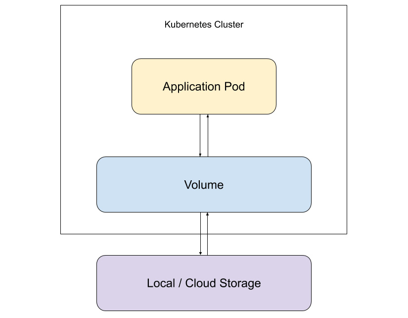
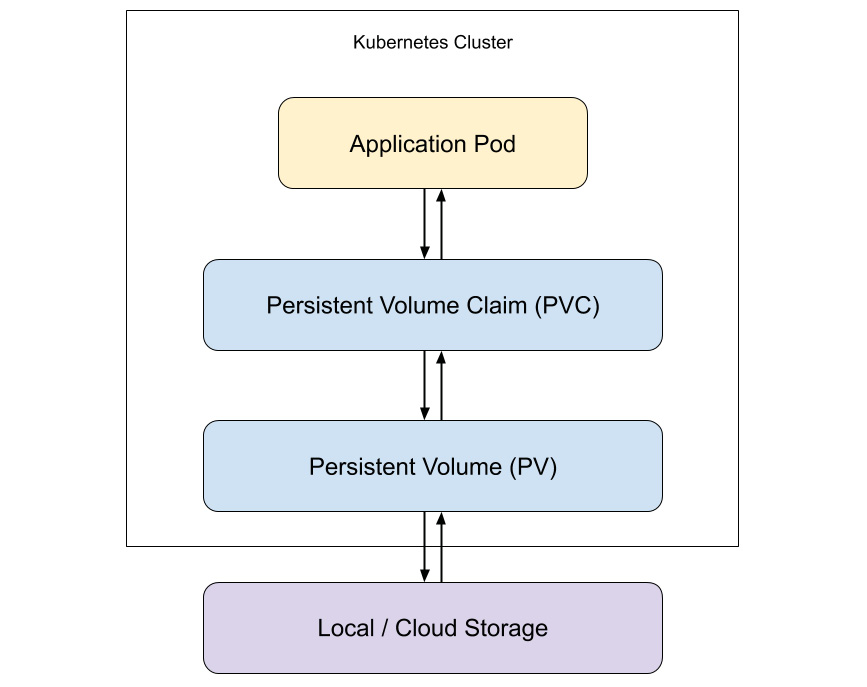

# Storing And Reading Data on Disk
- In this session, we will see how to create resources called Volumes to temporarily store data independent of a container's lifecycle, as well as share data among different containers inside the same Pod.
- We will also look at using PersistentVolumes to store data independent of a Pod's lifecycle.
- We will see how to use PersistentVolumeClaims to dynamically provision storage/volumes for Pods.


- In practice, most applications have to either read data or write data to a file. Some of the data written locally will have to be shared with other programs/applications to read from - a case where an application writes logs to a file and another app reads those logs from that file.
- This above example is possible in a sidecasr container setup inside a Pod. To properly enable this, the storage (log file) has to be shared amongst the different containers in the Pod.
- Data generated by Pods has to be stored in such a way that it is not tied to the lifecycle of the Pod. When the Pod terminates, the data should still be accessible for use. In the same way, the data generated by containers in a Pod should be stored in such a way that it is not tied to the container's lifecycle.
- The Kubernetes storage object called **Volume** is what can be used to serve these purposes.


## Volumes
- The **Volume** object is an abstraction of a physical storage to a Pod in the Kubernetes cluster. The Volume is the physical storage (outside of a cluster) that is exposed to the application Pod (inside of the cluster).
- Here is a diagram: 
- For a standard Volume, the lifetime of this standard Volume is tied to the Pod that uses it. In this case, when the Pod is terminated, the Volume is also terminated. However, for this same standard Volume, if the containers in the same Pod get redeployed, the Volume can still be used by the new containers.
  - To solve the issue of Volumes being terminated when Pods are terminated, there is a Volume type called PersitentVolumes (PVs) that can be used to persist data that is independent of the Pod lifetime.

- Here is a sample configuration for Volumes, that is contained in the Pod specification
```YAML
apiVersion: v1
kind: Pod
metadata:
  name: pod-with-volume
spec:
  containers:
  - name: container-with-access-to-volume
    image: alpine
    volumeMounts:
    - name: data-volume
      mountPath: /var/log/data
  volumes:
  - name: data-volume
    emptyDir: {}
```
- in the above manifest, the **.spec.volumes** field defines the Volumes that are available for the Pod to use.
- in the above manifest, the **.spec.containers.volumeMounts** defines where to mount the Volumes in the container. This field is unique to every container in the Pod.


### Defining Volumes
- In the sample YAML manifest, the **.spec.volumes** is where we define the Volumes made available to use used by the Pod specification. It has two fields:
1. **name** - this is the name that the Volume will be referred to when a container wants to mount the Volume. It should be a valid DNS name. The name must also be unique within the single Pod.
2. **emptyDir** - this field actuallu represents the type of volume being made available for mounting. This field also defines the actual configuration of the volume.


### Mounting Volumes
- the **.spec.containers.volumeMounts** is where we define the how to mount a Volume on a container. It has the following fields:
1. **name** - this is the name of the Volume to be used.
2. **volumeMount** - this is the path inside the container where the Volume should be mounted. Each container can mount the same Volume on different paths.
- There are other optional fields we can set when mounting volumes:
1. **subPath** - this represents the exact path in the Volume that should be mounted in the container. This field is used to mount a sub-directory in the volume and not the entire volume; by default, the entire volume is mounted. A use case is when using the same volume for two containers, you can mount them in differente sub-directories.
2. **readonly** - this determines if the volume mounted should be made a read-only volume. By default, the mounted volume has read-write access.


## Types of Volumes
- Kubernetes supports many types of volumes. These volumes vary depending on the environment which the cluster is deployed. Cloud environments will have different configs from bare-metal environments.
- The common types of Volumes are:
1. **emptyDir** - this refers to an empty directory that is created when a Pod is assigned to a Node. It has its lifetime attached to the lifetime of the Pod. All the containers running inside this Pod have the ability to read and write to this directory. The emptyDir can be mounted on mutiple containers.
  - its basic configuration is like this:
  ```YAML
  apiVersion: v1
  kind: Pod
  metadata:
    name: pod-with-volume
  spec:
    containers:
    - name: container-with-access-to-volume
      image: alpine
      volumeMounts:
      - name: data-volume
        mountPath: /var/log/data
    volumes:
    - name: data-volume
      emptyDir: {}
  ```
  - by default the emptyDir will be stored on the disk (HDD/SSD). It can be modified to use RAM instead using this config:
  ```YAML
  volumes:
  - name: data-volume
    emptyDir:
      medium: Memory
  ```
  - using a RAM-based filesystem (tmpfs) to store can be fast as compared to HDD/SSD. It also has downsides. (1) the tmpfs is cleared on a reboot of the node and, (2) the tmpfs counts against the memory limits set on the container.
  - we can assign a size limit to the storage being used by the emptyDir. It can be set with this config:
  ```YAML
  volumes:
  - name: data-volume
    emptyDir:
      sizeLimit: 1Gi
  ```
  - this sizelimit applies to both disk- and memory-based storage. Interestingly, in the case of memory-based volumes, the maximum usage allowed will be either the sizeLimit value or the sum of all the memory limits on all containers in the Pod - the lower value is picked.
  - some use-cases for emptyDir volumes are: (1) as a temporary scratch space for computations that require a lot of space - like on-disk merge sort. (2) as storage for checkpoints in long computations - such as in ML models where progress needs to be saved for recovery in the event of a crash.

2. **hostPath** - this is used to mount a file or directory from the node's filesystem unto the Pod. 
  - An example of such a configuration is:
  ```YAML
  apiVersion: v1
  kind: Pod
  metadata:
    name: pod-with-volume
  spec:
    containers:
    - name: container-with-access-to-volume
      image: alpine
      volumeMounts:
      - name: data-volume
        mountPath: /var/log/data
    volumes:
    - name: data-volume
      hostPath:
        path: /tmp
        type: Directory
  ```
  - From the configuration, the /tmp directory on the node is mounted to the /var/log/data in the Pod/container. All data written to the /var/log/data in the container is sent to the /home/user/tmp directory on the node.
  - There are two(2) fields under the hostPath volume specification:
    1. **path**: this is the path to the file or directory on the node that will be mounted unto the container. This path can be any of the following: (1) a symbolic link to a directory or a file, (2) the address of a UNIX socket, (3) a character device or a (4) block device. This path is defined by the *type*.
    2. **type**: this is an optional field that is used to specify the type of volume used in the path. When this type is specified, certain checks are performed before mounting the hostPath volume. The follwoing values can be used in this field:
      - **""** (an empty string): this is the default value. This means no checks will be performed before mounting the hostPath volume. If the path specified does not exist on the node, the Pod will still be created without verifying the existence of the volume BUT the Pod will keep crashing because of this error.
      - **DirectoryOrCreate**: this points to a directory path. If the directory path does not exist on the host node, it will be created.
      - **Directory**: this implies that the directory path exists on the host node already. If it does not, there will be a FailedMount error while creating the Pod.
      - **FileOrCreate**: this points to a file path. If the file path does not exist on the host node, it will be created.
      - **File**: this implies that the file path exists on the host node already.
      - **Socket**: this asserts that a UNIX socket must exist at the path specified.
      - **CharDevice**: this implies that a character device must exist at the path specified.
      - **BlockDevice**: this implies that a block device must exist at the path specified.
  - There are some niche use-cases for the hostPath volume and they are:
    - (1) for allowing Pods to be created if only a particular host path is present on the host node before running the Pod. eg. a secret file or config must be present on the node before running the Pod.
    - (2) for running a container that needs access to Docker internals. eg. normally done by setting the host path to /var/lib/docker.
  
- Information on the volumes provided by cloud platforms can be found [here](https://kubernetes.io/docs/concepts/storage/volumes/#types-of-volumes).


## Persistent Volumes
- Normal volumes are tied to the lifecycle of the Pods, not the containers, and they are not suited frp storing data that we want to persist.
- Kubernetes has provided storage that supports the persistent storage of data called **PersistentVolume** (PV). The PV represents a block of storage in the cluster. The Persistent Volume is considered a clister resource as it is available for use by al objects that request it - and not scoped to a namespace.
- The Persistent Volume storage can either be provisioned beforehand or dynamically provisioned when needed.
- The Persistent Volume object is not tied to the lifecycle of the Pod.
- The Persistent Volume object works just like the standard Volumes. From a Pod's perspective, there is no difference between using a normal Volume and a Persistent Volume.

- However, in order to use a Persistent Volume, a **PersistentVolumeClaim** (PVC) object has to be created.
- The PVC is a request for storage by a user or a Pod. It is used to request specific kinds and sizes of storage and also specific access modes to the storage requested.
- The PVC is scoped to namespaces - ie. Pods can only access PVCs created in the namespace they are in. This essentially translates into them accessing storage only the PVCs scoped to the namespace have access to.

.

- The separation of the request for storage (PVC) and the actual storage (PV) allows application developers to not worry about the kinds of storage to explicitly specify for usage. This loose binding also provides the added advantage of incorporation resilience and stability in case of Pod failures.

- The list of all types of Persistent Volumes can be found [here](https://kubernetes.io/docs/concepts/storage/persistent-volumes/#types-of-persistent-volumes).

- This is a sample configuration of a PersistentVolume in YAML manifest format:
```YAML
apiVersion: v1
kind: PersistentVolume
metadata:
  name: persistent-volume
spec:
  storageClassName: standard
  capacity: 
    storage: 10Gi
  volumeMode: Filesystem
  accessModes:
    - ReadWriteMany
  persistentVolumeReclaimPolicy: Retain
  nfs:
    server: 172.10.1.1
    path: /tmp/pv
```

- Here are the important fields in the PV spec section:
  - **storageClassName**: this is the name that is associated with a certain kind of storage needed by a PV. A StorageClass is a Kubernetes object that is used by Kubernetes admins to define the different profiles of storage that are available or are supported. 
    - Having a StorageClass allows the admins to create storage clusters based on performance and capacity.
    - A cluster admin can configure the StorageClasses that will be made available. Each StorageClass has its own provisioners, backup policies, and reclamation policies.
    - A provisioner is a system that determines how to provision a PV of a particular type. There are internal provisioners and external ones
    - A PV belonging to a certain StorageClass can only be bound to a PVC requesting that particular class. Any PV without this field will only be available to PVC that do not request a specific StorageClass.
  - **capacity**: this denotes the storage capacity that should be carved out for the PV.
  - **volumeMode**: this denotes how we want the Pod to use the storage. We could have it as **Block** in order to use the raw block device as storage, or set it to **Filesystem** to use a filesystem on the storage.
  - **accessModes**: this shows the capabilities that are allowed, in terms of reading and writing data, for a mounted volume. A volume can be mounted with only one of the following:
    - (1) **ReadWriteOne (RWO)** - read-write for a single node only.
    - (2) **ReadOnlyMany (ROX)** - read-only for many nodes.
    - (3) **ReadWriteMany (RWM)** - read-write for many nodes
    **NOTE**: Not all types of volumes support all access modes. Always check for the allowed access mode for a volume.
  - **persistentVolumeReclaimPolicy**: If a Pod is done using a Volume, they can delete the PVC and that makes the PV available for use again. The reclaimPolicy determines whether the PV can actually be used again, they are:
    - (1) **Retain** - this makes sure the data stored on the PV remains even after the PV has been released. The admin will have to delete that data manually if they want to empty it. With this policy, the PV is marked as **Released** instead of **Avaialable**.
    - (2) **Recycle** - this policy makes sure that one a PV is released, the data in the volume is deleted, and the PV is marked as **Available**. This makes the PV ready to be claimed again. Using dynamic provisioning is a better alternative to using this policy
    - (3) **Delete** - with this policy, the PV itself and all the data it contains is deleted once the PV is released.
  On different cloud provider platforms, they are different ReclaimPolicies. Make sure to read up on them before using the policy.

- To check up on PersistentVolumes, they have statuses to show what is happening to them at any momnent in their lifecycle. These statuses are:
  - (1) **Available** - this indicates that the volume is yet to be claimed.
  - (2) **Bound** - this shows the volume has been successfully bound to a volume claim.
  - (3) **Released** - this indicates that the PersistentVolumeClaim bound to this volume has been deleted and the volume is yet to be reclaimed by another.
  - (4) **Failed** - this indicates that there has been a failure during reclamation of the volume.


## Persistent Volume Claims
- The PersistentVolumeClaim also has configuration that is in YAML format that can be deployed; note that it is bound to a namespace.
  - an example configuration of this is:
  ```YAML
  apiVersion: v1
  kind: PersistentVolumeClaim
  metadata:
    name: example-persistent-volume-claim
  spec:
    storageClassName: standard
    resources:
      requests:
        storage: 500Mi
    volumeMode: Filesystem
    accessModes: 
      - ReadWriteMany
    selector:
      matchLabels:
        environment: production
  ```
- Diving into the important fields in the PVC configuration:
  - **storageClassName**: by specifying a storageClass name, the PVC can request storage from that storageClass. A PV with same storageClass will match a PVC requestng a PV of same storageClass.
  If the storageClassName is set to and empty string, **""**, only PVs with no storageClass set will be bound.
  On the other hand, if a cluster admin sets and enables a **DefaultStorageClass**, then all PVC with no storageClass set will be bound to PVs with the default storageClass
  - **resources**: this is where the storage requests are specified. Only PVs satisfying these resource requests can be bound to a PVC.
  - **volumeMode**: this specifies the mode of storage the PV should have, either a filesystem or block storage. Only PVs matching the specified storage mode will be bound.
  - **accessMode**: this indicates the access mode needed. Any PV with the same access mode is matched and bound.
  - **selectors**: in this, the PVCs can use the matchLabels or matchExpressions fields to specify the criteria of PVs that can satisfy a particular claim. When this is stated, only the PVs whose labels satisfy these criteria are matched and considered for a claim. When both the matchLabels and matchExpressions fields are specified together, their conditions are combined with an AND operator.
  In the example, only PVs with the "environment: production" label are considered first.


## How To Use Persistent Volumes
- In order to use a PersistentVolume, there are three(3) steps to follow: (1) you have to provision the volume, then (2) you have to bind the PV to a claim and finally (3) use the claim as a volume on the Pod.

- (1) **Provisioning the Volume**: A Volume can be provisioned either statically or dynamically.
  - in static provisioning, the cluster admin has to provision all the PVs beforehand, only after are they available to be used by the PVCs
  - in dynamic provisioning, the cluster itself will dynamically provision the PV needed by the PVC based on the storageClass requested. If any change in PV requests is detected, Kubernetes itself will handle its provisioning. Dynamic provisioning is feasible on cloud providers, as they have lots of storageClasses.

- (2) **Binding the Volume to the Claim**: Here, a PersistentVolumeClaim is created with specific storage limits, specific access modes, and the specific storageClass. The Kubernetes controller will then match the PV satisfying all the criteria stated in the PVC.

- (3) **Using the Claim**: Once the PVC has found a PV and bound it, the PVC can then be used in the Pod configuration. The Pod will then have the PV mounted.

- an example configuration for using PVCs as Volumes is:
```YAML
apiVersion: v1
kind: Pod
metadata:
  name: pod-pvc-as-volume
spec:
  containers:
  - name: nginx
    image: nginx:alpine
    imagePullPolicy: IfNotPresent
    volumeMounts:
    - name: example-storage
      mountPath: /mnt/data
  volumes:
  - name: example-storage
    persistentVolumeClaim: ## add this fot PVCs
      claimName: example-claim
```


## Dynamic Provisioning
- Dynamic provisioning enables the creation of storage volumes on-demand.
- The cluster admin does not have to provision volumes beforehand, the volume is only provisioned when it is needed.
- For dynamic provisioning to be seamless, the cluster admin needs to create a StorageClass that will be used in the PVCs to claim volumes.
- The StorageClass for the dynamic provisioning needs tp specify the provisioner for the volumes. The provisioner is what provides the underlying storage where the PVs are carved from. Provisioners depend on the environment where the cluster is.
- Here is an example of the StorageClass being carved on the AWS platfrom:
```YAML
apiVersion: storage.k8s.io/v1
kind: StorageClass
metadata:
  name: example-storage-class
provisioner: kubernetes.io/aws-ebs
parameters:
  type: io1
  iopsPerGB: "10"
  fsType: ext4
```
- Every provisioner has documentation on what the parameters are.

This is a great [resource](https://mauilion.dev/posts/kind-pvc/) for working with StorageClasses in KinD