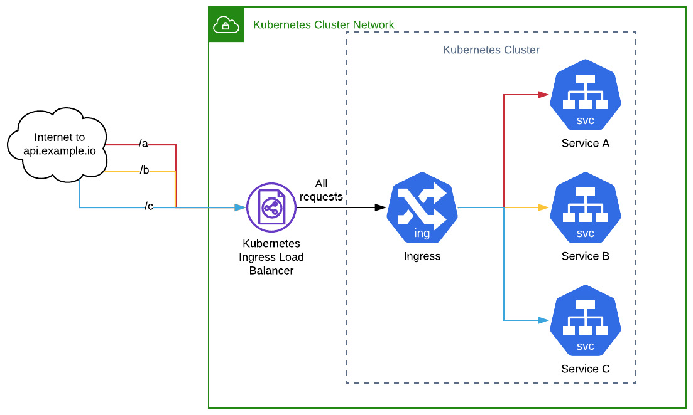

# High Availability In A Kubernetes Cluster
- The initial portions of this book require working with a cloud environment but I do not have such at the moment.
- I will therefore skip a lot of these; especially using Terraform to deploy some resources on these cloud providers.

## Infrastructure Life Cycle Management
- Infra Life Cycle Management refers to how we manage our infrastructure through each phase of its useful life.
- The useful life includes the provisioning, maintaining and de-comissioning of the infra.
- When using cloud resources/infra, it is best to leverage the tools that will help you progress through the infra life cycle programmatically.
- Misconfigurations are the bane of any infra admin who uses manual means of managing the life cycle of their infrastructure.
- The best way to manage infra, the cloud-native way is to have a source of truth (in code) for infra. This will make tracking changes, controlling deployments and maintenance programmatic.
  - This leaves the code with the burden of resolving differences between what the admin declares and what is observed in reality.
- Infrastructure is only as good as the life cycle management tools around it, and the application that runs atop it.
  - A solid, well-built inifrastructure that has no room for programmatic life cycle management will not serve well.

## Kubernetes Ingress
- To understand what Ingress does, you need to know how a service was exposed outside of the Kubernetes cluster in the early days.
  - In the early days of Kubernetes, the only ways to expose your application to the internet was to use either the NodePort or use the LoadBalancer service.
  - The LoadBalancer service worked in such a way that only one Service could be exposed at a time through one LoadBalancer. This meant that if you had 10 services to expose, you needed to pay for 10 LoadBalancer services (not cheap btw).
  - Also if you had multiple paths to route to and had to implement a path-based routing, you would need to set up a LoadBalancer and another Service, and then perform the internal path resolution with that Service to the application you wanted.
    - Path-based routing is this: I have a site `api.ernest.io` and I want to send users to `/users` and the weather should be on the `/weather` path. The paths will now be `api.ernest.io/users` and `api.ernest.io/weather` respectively.
- With the introduction of Ingress; you can define multiple Services for your applications, have a single LoadBalancer and have all requests to these Services passing through the single LoadBalancer.
- The Kubernetes Ingress resource works in conjunction with an Ingress controller (an API level resource monitoring the Ingress resource).
- The configuration of how a Ingress works is better described in this photo: 
- The Ingress resource forwards the traffic it receives from the Ingress endpoint to the Services it was configured to forward the traffic to. Ingress Endpoint -> Ingress Resource -> Service.
- The commonly used, open-source tool for Ingress in Kubernetes is the **ingress-nginx** Ingress controller. [LINK](https://kubernetes.github.io/ingress-nginx/).

## Working With Stateful Applications
- A stateful application is one whose output depends on these multiple factors: (1) input from user, (2) input from other applications and (3) past saved events.
- The factors that a stateful application depend on form the "state" of the application. The state of the application determines the behaviour of the application.
- In distributed systems, there a multiple replicas of the application. The generated state must then be shared amongst all the replicas to ensure the application is reliable (behaves correctly).
  - in a situation where the application has different states, it will behave abnormally.
- In the real world, stateless applications are coupled with stateful applications but this is not always the case.
- In order to have a reliable stateful application setup, the application system has to be designed in such a way as to incorporate statefulness into it. This means architects and developers must think about how they want to manage state.

## The CI/CD Pipeline
- With regards to Kubernetes and the rise of containerization, software is now needed to be deployed incrementally to end-users.
- In order to achieve this, CI/CD pipelines have been introduced to make sure these changes are delivered to the end-users through a tried-and-tested repeatable process.
- The CI (Continuous Integration) part of the process integrates new chnages to the source code, tests it and builds an arifact for deployment.
- The CD (Continuous Deployment/Delivery) part of the process used automated meand to deliver the application to end-users.
- An ideal CI pipeline should compile the source code, test it, and package it for delivery.
- An ideal CD pipeline should automatically interact with the infrastructure and deploy the packaged application. It should contain telemetry tooling to observe the immediate impact of the deployment.