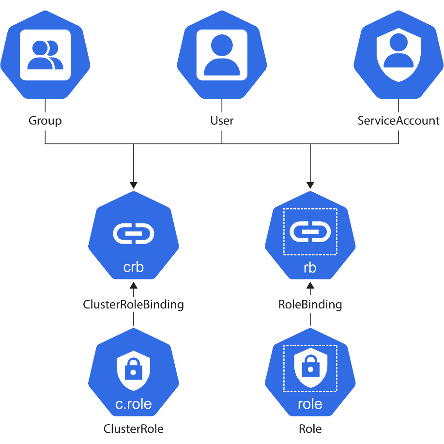

# Runtime And Network Security in Kubernetes
- Security is important when running workloads on a cluster.
- We have to know how to build and understand the threat model involved with running workloads on our cluster. With this, we can architect a secure cluster to mitigate/defend again various types of threats.
- Access control policies with Role and RoleBindings, ClusterRole and ClusterRoleBindings - from communication with the Kubernetes API.
- Use a NetworkPolicy to restrict communication between applications and their dependents.
- Use PodSecurityPolicy to handle the application limits of Pods.


## Threat Modelling
- Threat modelling is a discipline where we examine the various areas where the application can be vulnerable to attacks.
- The most common attack vectors for our application can be remembered by the acronym STRIDE.
  - Spoofing: user or application disguising as someone else.
  - Tampering: changing data without seeking consent or informing the concerned stakeholders.
  - Repudiation: being able to deny involvement in ay actions / the lack of ability to trace ay actions to a particular user.
  - Information Disclosure: getting access to privileged or sensitive information you were not meant to have.
  - Denial of Service: flooding a server with bogus requests to saturate its resources and deny it the ability to serve its intended purpose.
  - Elevation of Privilege: getting access to a restricted resource or privilege by exploiting bugs.

- There has been developed, a mental model for how to assess where threats to the cloud-native application stack migh come from. This mental model is called the `4 Cs of Cloud Native Security`.
- These layers are `code ==> container ==> cluster ==> cloud/bare-metal infra`.
- The ways to secure your application through the 4 layers mentioned above in Kubernetes is stated in this [documentation](https://kubernetes.io/docs/concepts/security/).

- How then do we secure our Kubernetes cluster?

## Cluster Security
- Kubernetes can be though of as a self-orchestrating pool of compute, network and storage. It can be likened to an autonomous cloud provider.
- A cluster operator can be defined as any user that ensures all the components of the cluster are secure and hardened against any workload.
- A cluster developer is any user that ensures the workload they are defining for Kubernetes is running securely in the cluster.
- Most cloud providers provide some hardening for Kubernetes clusters out-of-the-box - espeiclly on the control plane.
  - even with this offering, the cluster is not completely secure. According to the 4 Cs of Cloud Native Security, any vulnerabilities down that stack can compromise security for all.
  - the best way is to secure your own cluster. This [documentation](https://kubernetes.io/docs/tasks/administer-cluster/securing-a-cluster/) provides more information on how to do so.

- How do we secure workloads within the cluster?
- At the time of this, Kubernetes has the following that it uses to fortify internal cluster security:
  - **RBAC** - it defines roles and permissions, as well as how these permissions are granted to these roles. RBAC is the main policy engine for Kubernetes.
  - **NetworkPolicies** - these are policies that act as "firewalls" between Pods. They are dependent on the CNI (Container Network Interface) plugin used. Liken them to Network Access Control Lists that Kubernetes is aware of.
  - **PosSecurityPolicies (deprecated)** - they define how a Pod is allowed to run in cluster. This is now known as Pod Security Standards, managed by the Pod Security Admission Controller.


## Kubernetes RBAC
- RBAC stands for Role-Based Access Control.
- It is the fundamental way to constrain users and groups in Kubernetes. The constraints are based on the principle of least privileges - where a user is given ONLY the permissions it needs to do its job.
- RBAC sits at the Authorization layer of the sequence of request handling by the API - between Authentication and Admission.
- Cluster admins can implement RBAC through these 4 API objects; (1) Roles, (2) RoleBindings, (3) ClusterRoles and (4) ClusterRoleBindings.
- Any User, Group or ServiceAccount obtains its permissions by bound to a Role / ClusterRole via the appropriate Bindings. 



### Roles
- A Role defines the permissions that are necessary to be provided.
- A sample Role is defined here:
```YAML
apiVersion: rbac.authorization.k8s.io/v1
kind: Role
metadata:
  namespace: default
  name: test-role
rules:
  - apiGroups: [""]
    resources: ["pods"]
    verbs: ["list"]
```
- These fields define the permissions a Role should have:
  - *namespace* - the namespace these permissions apply to.
  - *verbs* - these are the actions the holder of these permissions can perform.
  - *apiGroups* - these define the API Groups the Role will have access to. These are specified as `<group>/<version>`. If CustomResourceDefinitions are used, they can be referenced here as well.
  - *resources* - these define the API objects the holder of the permissions has access to.

- I am currently on Kubernetes v1.31, here are the [API groups](https://kubernetes.io/docs/reference/generated/kubernetes-api/v1.31/) that ship with it.


### RoleBindings
- A RoleBinding defines the bind/association of a Role to ServiceAccounts, users or groups.
- A sample for a RoleBinding is this:
```YAML
apiVersion: rbac.authorization.k8s.io/v1
kind: RoleBinding
metadata:
  name: test-role-binding
  namespace: default
roleRef:
  name: test-role
  kind: Role
  apiGroup: rbac.authorization.k8s.io/v1
subjects:
  - kind: ServiceAccount
    name: test-sa
    namespace: default
```
- the spec defines the subjects that are bound to the Role. These subjects will use the Role permissions to perform their tasks.
  - *subjects* - refers to the authenticated user, group or ServiceAccount that should embody the Role.
  - *roleRef* - this references the Role the subjects can assume.

- For ClusterRoles and ClusterRoleBindings, they have the same specs as the Role and RoleBindings.
  - the only different thing is that, they are not scoped to a namespace. Their permissions apply cluster-wide.

#### Notes about RBAC Policies
- RBAC policy documents are allow-only.
  - this means that, by default, a subject has no permissions. Only by RoleBindings/ClusterRoleBindings will it be granted specific access. That access is limited to the permissions in the Role or ClusterRole.
- Bindings are immutable.
  - Once a subject has been bound to a Role or ClusterRole, it cannot be changed. This is used to mitigate privilege escalation.
  - If a Binding needs to be modified; delete the Binding, update the Role and recreate the Binding.
- For a Role or ClusterRole that can create other Roles or ClusterRoles, it will only be able to grant, at most, the same permissions it has.
  - anything beyond that is a path to privilege escalation.


### ServiceAccount
- A ServiceAccount is the object type that Kubernetes has for allowing resources within the cluster to authenticate the API server.
- The ServiceAccount resource allows Pods to receive Kubernetes-generated tokens. These tokens will be passed to the API server for authentication.
  - for the type of auth above, the official Kubernetes client libraries support this. It is the preferred method for programmatic API access from within the cluster.
- If you are a cluster admin, you can authenticate with a particular ServiceAccount using the `--as` parameter like `kubectl --as=system:serviceaccount:default:test-sa get pods`.

- A few security recommendations regarding cluster security are:
  - make cluster users / contributors to a cluster have a Role instead of a ClusterRole. A Role is constrained to an namespace and will mitigate unauthorized access to other namespaces.
  - only cluster admins should have ClusterRoles. These ClusterRoles shoule be limited and temporary in scope. They should only be issued if a cluster admin is to work inside a cluster.


### NetworkPolicy
- Network Policies are objects in Kubernetes that act as Network Access Control Lists (NACLs) at the Pod and Namespace level.
- They work by allowing traffic access on a particular port/protocol.
  - you can use label selection for traffic access (from Service objects).
  - you can specify an CIDR IP range to allow on traffic access for.
- A scenario where this is helpful is a microservice architecture where you have a marketing site, a backend-app site and a database with sensitive data. The backend-app talks to the database, but the marketing site has nothing to do with the database. We can use a NetworkPolicy to prevent the marketing site from accessing the database. This also will hinder any explotation in the marketing site that might lead an attacker to the database.
- A sample NetworkPolicy is this:
```YAML
apiVersion: networking.k8s.io/v1
kind: NetworkPolicy
metadata:
  name: sample-network-policy
  namespace: test
spec:
  podSelector:
    matchLabels:
      role: db
  policyTypes:
  - Ingress
  - Egress
  ingress:
  - from:
    - ipBlock:
        cidr: 192.168.0.0/16
        except:
        - 192.168.1.0
    - namespaceSelector:
        matchLabels:
          project: myproject
    - podSelector:
        matchLabels:
          role: frontend
    ports:
    - protocol: TCP
      port: 3245
  egress:
  - to:
    - ipBlock:
        cidr: 10.0.0.0/24
    ports:
    - protocol: TCP
      port: 7645
```
- the `spec.podSelector` applies to the grouping of Pods to which the Policy applies.
- the `spec.policyTypes` states the given policies that are to be allowed. Could be ingress, egress or both. ie. traffic coming in, traffic leaving or both.
- the `spec.ingress` is where traffic comming in to the Pods selected is defined. It takes a `from` block that defines where traffic can originate from - into the Pod.
  - this can be a namespace, a pod selector or a IP+port combination.
- the `spec.egress` is where traffic leaving the Pods is defined. It takes a `to` block that defines where traffic can leave to.
  - this can also be a namespace, pod selector or a IP+port combination.

- To utilize the NetworkPolicy object to its full capacity, you need a mature CNI that has NetworkPolicies; Calico, Cilium are good CNIs.


### Pod Security Context (fka + deprecated - podSecurityPolicy)
- This field is written within the Pod context to define the privileges and access control setting that the Pod is assigned.
- This is used to make sure the Pods are compliant with some set standards. Doing this plugs vulnerability holes.
- The contexts include, but not limited to the following:
  - discretionary access control - permission to access an object as a user or group
  - selinux - objects being assigned security labels
  - running as privileged or non-privileged
  - linux capabilities - a process is given some more privileges, but not all privileges of the root user
  - appArmor - using program profiles to restrict the capabilities of the root user
  - seccomp - filter a process's system calls
  - allowPrivilegeEscalation - allow a process to gain more privileges than its parent process
  - readOnlyRootFilesystem - mounts the container's root filesystem as read-only.
- More can be found on the [documentation page here](https://kubernetes.io/docs/tasks/configure-pod-container/security-context/). (NOTE TO SELF: ABSOLUTELY READ THIS)